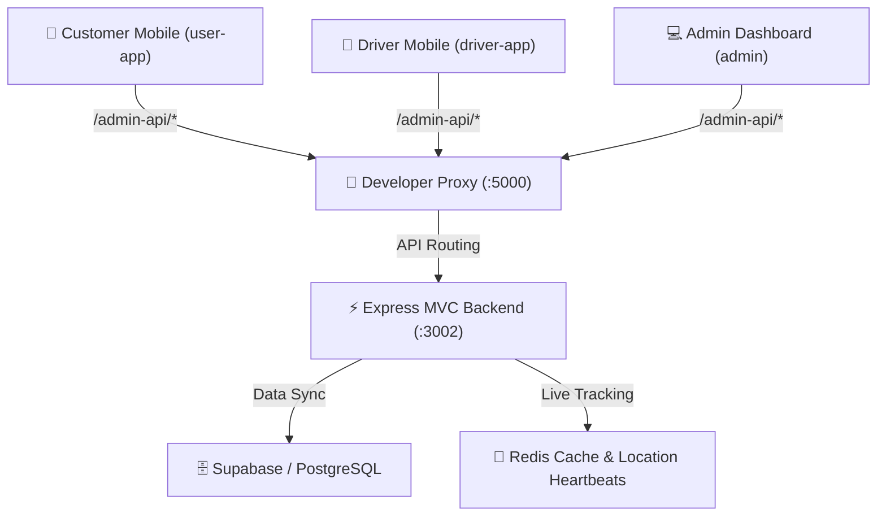

# JAHEEZ Architecture Map

> **Single Source of Truth for Workspace Layout, Codebase Structure, and Routing Flow.**
> Last Updated: June 12, 2026

---

## 1. System Topology Overview



---

## 2. Directory Structure Map

```
jaheez-v1/
├── backend/                       # Centralized Express MVC Backend (Port 3002)
│   ├── src/
│   │   ├── config/                # Environment variables, logs, etc.
│   │   ├── db/                    # Supabase database client instantiation
│   │   ├── features/              # Feature domains containing MVC layers
│   │   │   ├── auth/              # Role-specific Authentication routers
│   │   │   ├── driver/            # Heartbeats, KYC docs, and order issues
│   │   │   ├── finance/           # Wallets, payout requests, COD settlements
│   │   │   ├── order/             # Customer checkout and admin orders management
│   │   │   ├── settings/          # CMS cities, categories, promos, banners
│   │   │   └── support/           # Support tickets and review moderation
│   │   ├── middleware/            # JWT authentication, role guards, error handlers
│   │   ├── notifications/         # Broadcasts and push notification handlers
│   │   ├── redis/                 # Redis connection client
│   │   └── workers/               # Location tracking and auto-dispatch loops
│   
├── frontend/                      # Client-Side Applications
│   ├── user-app/                  # Customer Mobile Application (Expo 55)
│   │   ├── app/                   # File-based navigation (auth, tabs, flows)
│   │   ├── features/              # Modular customer features (orders, wallet, etc.)
│   │   └── lib/                   # API clients and Supabase configurations
│   ├── driver-app/                # Driver Mobile Application (Expo 55)
│   │   ├── app/                   # File-based navigation (KYC pending gates, tabs)
│   │   ├── features/              # Modular driver features (delivery, payout, profile)
│   │   └── lib/                   # Driver API client (api.ts)
│   └── admin/                     # React Vite Admin Panel
│       ├── src/
│       │   ├── features/          # Modular admin operations features with views/services
│       │   └── lib/               # Admin API integrations
│
├── shared/                        # Shared TypeScript Schemas & Enums
│   ├── types.ts                   # Interfaces for User, Driver, Order, Wallet, etc.
│   └── constants.ts               # Status mappings and billing configurations
│
└── scripts/                       # Developer Utility Scripts
    └── proxy.js                   # Developer routing proxy (port 5000)
```

---

## 3. Unified API Gateway Layout

All frontends query the unified backend through the gateway on port `5000`. The gateway routes the `/admin-api/*` prefixes directly to the MVC backend running on port `3002`.

Within `backend/src/app.ts`, routes are separated by application domain and client scope to prevent privilege escalation:

### 🔑 Authentication Routes
*   **Admin Auth** (`/features/auth/adminAuth.routes.ts`):
    *   `POST /admin-api/login` - Admin JWT generation.
*   **Driver Auth** (`/features/auth/driverAuth.routes.ts`):
    *   `POST /admin-api/driver/login` - Password-less OTP & credentials login.
*   **Customer Auth** (`/features/auth/customerAuth.routes.ts`):
    *   `POST /admin-api/auth/register` - Create customer accounts.
    *   `POST /admin-api/auth/login` - Customer credentials validation.
    *   `DELETE /admin-api/auth/account` - Soft-delete user profile.
    *   `POST /admin-api/otp/send` & `/otp/verify` - OTP generation.

### 📦 Order & Checkout Routes
*   **Customer Orders** (`/features/order/customerOrder.routes.ts`):
    *   `POST /admin-api/v1/checkout` - Atomic transaction-safe checkouts.
    *   `POST /admin-api/v1/orders/:id/cancel` - Customer-initiated order cancellation.
    *   `POST /admin-api/v1/payments/stripe/checkout-session` - Card payment intents.
*   **Driver Orders** (`/features/order/driverOrder.routes.ts`):
    *   `POST /admin-api/v1/orders/:id/accept` | `/pickup` | `/deliver` - Live state transitions.
*   **Admin Orders** (`/features/order/adminOrder.routes.ts`):
    *   `GET /admin-api/orders` - Live active delivery list.
    *   `PATCH /admin-api/orders/:id` - Manual dispatcher modifications.

### ⚙️ Settings & CMS Routes
*   **Admin Settings** (`/features/settings/adminSettings.routes.ts`):
    *   `POST /admin-api/settings` - Global app settings update.
    *   `POST /admin-api/cities` | `POST /zones` | `POST /promotions` - CRUD metadata modifications.
*   **Public Settings** (`/features/settings/publicSettings.routes.ts`):
    *   `GET /admin-api/app-settings/public` - Public app constants.
    *   `GET /admin-api/cities/public` | `GET /active-promotions` - Read-only configurations.

---

## 4. Key Architectural Policies

> [!IMPORTANT]
> - **Centralized Calculations**: Frontend apps must **never** compute subtotals, delivery fees, taxes, commissions, or driver earnings. All financials are computed in `backend/src/features/order/checkout.service.ts` using integer centimes.
> - **Write Restrictions**: Client applications must never perform direct writes to Supabase. All modifications must go through backend endpoints protecting data layers.
> - **Supabase Single Pool**: Direct postgres connection pools (`pg.Pool`) are retired. All database reads and writes leverage the centralized `supabase` client.
> - **Audit Safeguard**: Any admin-side configuration modifications or manual balance adjustments must invoke the `AuditLogService` inside the database transaction path.
