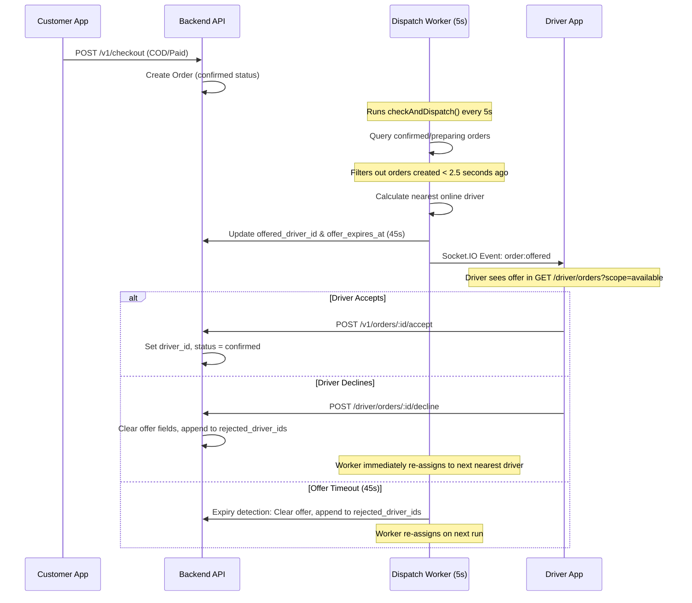

# DISPATCH SYSTEM REPORT

## Architecture Overview

JAHEEZ implements a server-authoritative live order dispatch engine. Freelance-style "order grabbing" is completely disabled. Drivers are matched automatically by proximity, and orders are offered sequentially.

---

## Detailed Dispatch Workflow



---

## Key Technical Components

### 1. Proximity Calculation & Dispatch Worker
*   **Worker:** [dispatch.worker.ts](file:///c:/Users/user/Desktop/jaheeez/Jaheez-v1/backend/src/workers/dispatch.worker.ts) runs on a 5-second interval.
*   **Proximity Logic:** Distance is calculated using the Haversine formula (calculated server-side). Eligible drivers are filtered to ensure they are online (`is_online = true`), have active coordinates, and are not in the `rejected_driver_ids` list.
*   **2.5s Smooth Delay:** Confirmed orders are ignored by the worker for the first 2.5 seconds after creation (`Date.now() - order.created_at < 2500`) to create a smooth transaction buffer.

### 2. Sequential Driver Offer Cycle
*   **Duration:** Each offer is valid for exactly 45 seconds (`offer_expires_at = now() + 45s`).
*   **Declines:** If the driver declines, `POST /driver/orders/:id/decline` triggers immediately, bypassing the 45-second timeout and allowing the worker to immediately offer the order to the next driver.

### 3. Driver App Integration
*   **Available Scope:** Driver requests `GET /driver/orders?scope=available`. The backend repository filters the response:
    ```sql
    SELECT * FROM orders 
    WHERE offered_driver_id = :driverId 
      AND offer_expires_at > now() 
      AND status IN ('confirmed', 'preparing')
    ```
*   **No Grab Lists:** Eliminates freelance order grab views. A driver only sees orders specifically offered to them.

---

## Risk & Validation Audit

### 1. Desync Risk (`DESYNC RISK`)
*   **Assessment:** Check if order assignments can conflict.
*   **Status:** **CLEARED**. PostgreSQL table locks (`FOR UPDATE`) are applied during status updates/claims to prevent race conditions (e.g., two drivers accepting the same order, or worker updating while driver accepts).

### 2. Architecture Violation (`ARCHITECTURE VIOLATION`)
*   **Assessment:** Ensure the frontend has no authority over driver assignment.
*   **Status:** **CLEARED**. The dispatch worker evaluates positions and assigns offers strictly on the backend.

### 3. Security Violation (`SECURITY VIOLATION`)
*   **Assessment:** Ensure drivers cannot claim orders not offered to them.
*   **Status:** **CLEARED**. The backend `claimOrder` lifecycle code validates that `offered_driver_id` matches the calling driver's ID before assigning.
