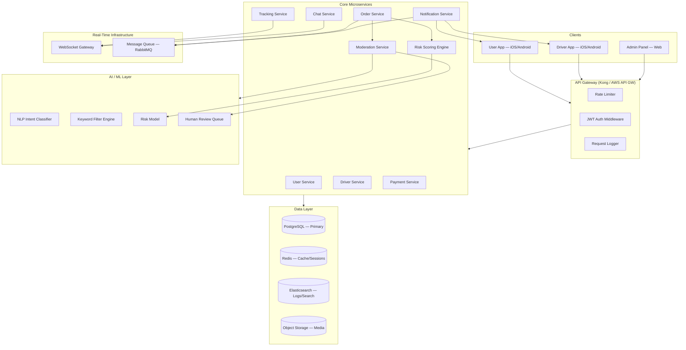
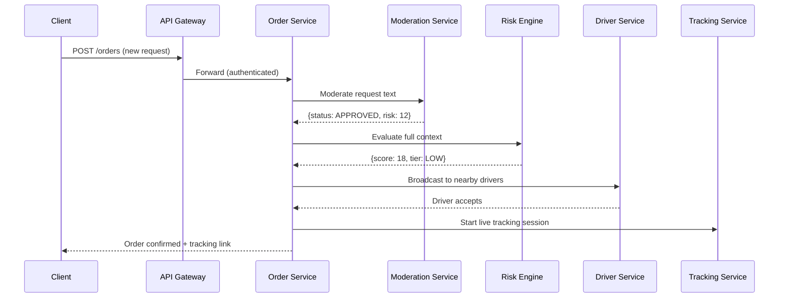
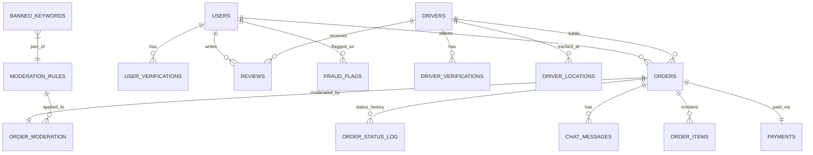

# Conique — Production System Design (Part 1)

> **Platform**: Local delivery + errand service · **Region**: Safi, Morocco
> **Actors**: Users (requesters), Drivers (agents), Admins, AI Moderation Engine

---

## 1. System Architecture

### 1.1 High-Level Overview



### 1.2 Technical Stack

| Layer | Technology | Rationale |
|---|---|---|
| **Backend** | Node.js (NestJS) | Type-safe, scalable, excellent WebSocket support |
| **Primary DB** | PostgreSQL 16 | ACID, PostGIS for geolocation, JSONB for flex data |
| **Cache** | Redis 7 | Session store, rate-limiting, real-time driver positions |
| **Message Queue** | RabbitMQ | Decoupled async processing (notifications, moderation) |
| **Real-Time** | Socket.IO over WebSocket | Tracking, chat, live order updates |
| **Search/Logs** | Elasticsearch + Kibana | Full-text search, audit log analytics |
| **Object Storage** | MinIO / S3 | ID documents, chat images, receipts |
| **AI/NLP** | Python (FastAPI) microservice | Intent classification, keyword filtering |
| **Mobile** | React Native / Flutter | Cross-platform for iOS + Android |
| **Admin Panel** | Next.js | SSR dashboard with charts |
| **CI/CD** | GitHub Actions → Docker → K8s | Automated deployments |
| **Monitoring** | Prometheus + Grafana + Sentry | Metrics, alerting, error tracking |

### 1.3 Service Communication



---

## 2. Database Design

### 2.1 Entity-Relationship Diagram



### 2.2 Core Tables

#### `users`
```sql
CREATE TABLE users (
    id              UUID PRIMARY KEY DEFAULT gen_random_uuid(),
    phone           VARCHAR(20) UNIQUE NOT NULL,  -- +212 format
    full_name       VARCHAR(120) NOT NULL,
    email           VARCHAR(255),
    password_hash   TEXT NOT NULL,
    avatar_url      TEXT,
    is_verified     BOOLEAN DEFAULT FALSE,
    is_banned       BOOLEAN DEFAULT FALSE,
    ban_reason      TEXT,
    trust_score     SMALLINT DEFAULT 70 CHECK (trust_score BETWEEN 0 AND 100),
    locale          VARCHAR(5) DEFAULT 'ar-MA',
    created_at      TIMESTAMPTZ DEFAULT NOW(),
    updated_at      TIMESTAMPTZ DEFAULT NOW()
);
CREATE INDEX idx_users_phone ON users(phone);
```

#### `drivers`
```sql
CREATE TABLE drivers (
    id                  UUID PRIMARY KEY DEFAULT gen_random_uuid(),
    user_id             UUID REFERENCES users(id) ON DELETE CASCADE,
    vehicle_type        VARCHAR(20) NOT NULL CHECK (vehicle_type IN ('motorcycle','car','bicycle','on_foot')),
    license_plate       VARCHAR(20),
    id_card_front_url   TEXT NOT NULL,
    id_card_back_url    TEXT NOT NULL,
    selfie_url          TEXT NOT NULL,
    is_approved         BOOLEAN DEFAULT FALSE,
    is_online           BOOLEAN DEFAULT FALSE,
    current_zone        VARCHAR(50),             -- e.g., 'safi_centre', 'safi_nord'
    rating_avg          NUMERIC(3,2) DEFAULT 5.00,
    total_deliveries    INT DEFAULT 0,
    created_at          TIMESTAMPTZ DEFAULT NOW()
);
CREATE INDEX idx_drivers_online_zone ON drivers(is_online, current_zone);
```

#### `orders`
```sql
CREATE TABLE orders (
    id                UUID PRIMARY KEY DEFAULT gen_random_uuid(),
    user_id           UUID NOT NULL REFERENCES users(id),
    driver_id         UUID REFERENCES drivers(id),
    order_type        VARCHAR(20) NOT NULL CHECK (order_type IN ('delivery','errand')),
    status            VARCHAR(30) NOT NULL DEFAULT 'pending_moderation'
                      CHECK (status IN (
                        'pending_moderation','moderation_rejected','pending_driver',
                        'driver_assigned','in_progress','picked_up','delivered',
                        'completed','cancelled','disputed'
                      )),
    title             VARCHAR(200) NOT NULL,
    description       TEXT,
    category          VARCHAR(50),              -- 'food','grocery','pharmacy','custom_errand'
    pickup_address    TEXT,
    pickup_lat        DOUBLE PRECISION,
    pickup_lng        DOUBLE PRECISION,
    dropoff_address   TEXT NOT NULL,
    dropoff_lat       DOUBLE PRECISION NOT NULL,
    dropoff_lng       DOUBLE PRECISION NOT NULL,
    estimated_price   NUMERIC(10,2),
    final_price       NUMERIC(10,2),
    currency          VARCHAR(3) DEFAULT 'MAD',
    risk_score        SMALLINT DEFAULT 0 CHECK (risk_score BETWEEN 0 AND 100),
    moderation_status VARCHAR(20) DEFAULT 'pending'
                      CHECK (moderation_status IN ('pending','approved','flagged','rejected','manual_review')),
    scheduled_at      TIMESTAMPTZ,
    completed_at      TIMESTAMPTZ,
    cancelled_by      VARCHAR(10) CHECK (cancelled_by IN ('user','driver','system')),
    cancel_reason     TEXT,
    created_at        TIMESTAMPTZ DEFAULT NOW(),
    updated_at        TIMESTAMPTZ DEFAULT NOW()
);
CREATE INDEX idx_orders_user ON orders(user_id, created_at DESC);
CREATE INDEX idx_orders_driver ON orders(driver_id, status);
CREATE INDEX idx_orders_status ON orders(status);
CREATE INDEX idx_orders_geo ON orders USING GIST (
    ST_SetSRID(ST_MakePoint(pickup_lng, pickup_lat), 4326)
);
```

#### `order_moderation`
```sql
CREATE TABLE order_moderation (
    id                UUID PRIMARY KEY DEFAULT gen_random_uuid(),
    order_id          UUID NOT NULL REFERENCES orders(id),
    raw_text          TEXT NOT NULL,
    detected_language VARCHAR(5),             -- 'ar','fr','darija'
    keyword_flags     JSONB DEFAULT '[]',     -- [{"word":"xxx","severity":"HIGH"}]
    ai_intent         VARCHAR(50),            -- 'food_delivery','legal_errand','suspicious','illegal'
    ai_confidence     NUMERIC(4,3),           -- 0.000–1.000
    risk_score        SMALLINT NOT NULL,
    decision          VARCHAR(20) NOT NULL CHECK (decision IN ('auto_approve','auto_reject','manual_review')),
    reviewed_by       UUID REFERENCES users(id),  -- admin who reviewed
    review_notes      TEXT,
    reviewed_at       TIMESTAMPTZ,
    rules_triggered   JSONB DEFAULT '[]',     -- IDs of triggered rules
    created_at        TIMESTAMPTZ DEFAULT NOW()
);
CREATE INDEX idx_moderation_order ON order_moderation(order_id);
CREATE INDEX idx_moderation_decision ON order_moderation(decision);
```

#### `chat_messages`
```sql
CREATE TABLE chat_messages (
    id          UUID PRIMARY KEY DEFAULT gen_random_uuid(),
    order_id    UUID NOT NULL REFERENCES orders(id),
    sender_id   UUID NOT NULL REFERENCES users(id),
    sender_role VARCHAR(10) NOT NULL CHECK (sender_role IN ('user','driver','system')),
    content     TEXT NOT NULL,
    media_url   TEXT,
    is_flagged  BOOLEAN DEFAULT FALSE,
    flag_reason TEXT,
    created_at  TIMESTAMPTZ DEFAULT NOW()
);
CREATE INDEX idx_chat_order ON chat_messages(order_id, created_at);
```

#### `payments`
```sql
CREATE TABLE payments (
    id              UUID PRIMARY KEY DEFAULT gen_random_uuid(),
    order_id        UUID NOT NULL REFERENCES orders(id),
    user_id         UUID NOT NULL REFERENCES users(id),
    amount          NUMERIC(10,2) NOT NULL,
    currency        VARCHAR(3) DEFAULT 'MAD',
    method          VARCHAR(20) NOT NULL CHECK (method IN ('cash','card','wallet')),
    status          VARCHAR(20) NOT NULL DEFAULT 'pending'
                    CHECK (status IN ('pending','authorized','captured','refunded','failed')),
    provider_ref    VARCHAR(255),              -- external payment gateway reference
    created_at      TIMESTAMPTZ DEFAULT NOW(),
    updated_at      TIMESTAMPTZ DEFAULT NOW()
);
```

#### `driver_locations` (time-series, partitioned)
```sql
CREATE TABLE driver_locations (
    id          BIGSERIAL,
    driver_id   UUID NOT NULL REFERENCES drivers(id),
    lat         DOUBLE PRECISION NOT NULL,
    lng         DOUBLE PRECISION NOT NULL,
    speed_kmh   SMALLINT,
    heading     SMALLINT,
    recorded_at TIMESTAMPTZ DEFAULT NOW()
) PARTITION BY RANGE (recorded_at);
-- Monthly partitions created automatically
CREATE INDEX idx_driver_loc ON driver_locations(driver_id, recorded_at DESC);
```

#### `fraud_flags`
```sql
CREATE TABLE fraud_flags (
    id            UUID PRIMARY KEY DEFAULT gen_random_uuid(),
    user_id       UUID REFERENCES users(id),
    driver_id     UUID REFERENCES drivers(id),
    flag_type     VARCHAR(30) NOT NULL, -- 'velocity_abuse','fake_gps','multi_account','payment_fraud'
    severity      VARCHAR(10) NOT NULL CHECK (severity IN ('LOW','MEDIUM','HIGH','CRITICAL')),
    evidence      JSONB NOT NULL,       -- structured proof
    resolved      BOOLEAN DEFAULT FALSE,
    resolved_by   UUID REFERENCES users(id),
    created_at    TIMESTAMPTZ DEFAULT NOW()
);
```

#### Supporting tables (compact)

| Table | Purpose | Key Columns |
|---|---|---|
| `user_verifications` | KYC docs | `user_id`, `doc_type`, `doc_url`, `status`, `verified_at` |
| `driver_verifications` | Driver onboarding docs | `driver_id`, `doc_type`, `doc_url`, `status` |
| `reviews` | Ratings | `order_id`, `reviewer_id`, `target_id`, `rating (1-5)`, `comment` |
| `order_status_log` | State machine audit trail | `order_id`, `from_status`, `to_status`, `changed_by`, `timestamp` |
| `order_items` | Line items for delivery orders | `order_id`, `name`, `quantity`, `unit_price` |
| `moderation_rules` | Configurable rule definitions | `id`, `name`, `type`, `pattern`, `severity`, `is_active` |
| `banned_keywords` | Keyword blocklist (multi-language) | `word`, `language`, `severity`, `category` |
| `notifications` | Push/SMS log | `user_id`, `type`, `title`, `body`, `is_read`, `sent_at` |

---

## 3. API Design

### 3.1 Authentication

#### `POST /api/v1/auth/register`
```json
// Request
{
  "phone": "+212612345678",
  "full_name": "أحمد بنسعيد",
  "password": "SecureP@ss123"
}

// Response 201
{
  "message": "OTP sent to +212612345678",
  "verification_id": "ver_abc123"
}
```

#### `POST /api/v1/auth/verify-otp`
```json
// Request
{ "verification_id": "ver_abc123", "otp": "482917" }

// Response 200
{
  "access_token": "eyJhbGci...",
  "refresh_token": "dGhpcyBp...",
  "user": { "id": "u_1a2b3c", "full_name": "أحمد بنسعيد", "is_verified": true }
}
```

#### `POST /api/v1/auth/login`
```json
// Request
{ "phone": "+212612345678", "password": "SecureP@ss123" }

// Response 200  (same shape as verify-otp response)
```

---

### 3.2 Orders

#### `POST /api/v1/orders` — Create Order
```json
// Request
{
  "order_type": "errand",
  "title": "شراء أدوية من الصيدلية",
  "description": "Doliprane 1000mg x2, Vitamine C",
  "category": "pharmacy",
  "pickup_address": "Pharmacie Centrale, Bd Mohammed V, Safi",
  "pickup_lat": 32.2994,
  "pickup_lng": -9.2372,
  "dropoff_address": "Hay Salam, Rue 12, Safi",
  "dropoff_lat": 32.3050,
  "dropoff_lng": -9.2280,
  "payment_method": "cash"
}

// Response 201 — passes moderation
{
  "id": "ord_x7k9m2",
  "status": "pending_driver",
  "moderation": { "decision": "auto_approve", "risk_score": 8 },
  "estimated_price": 25.00,
  "currency": "MAD",
  "created_at": "2026-03-19T00:10:00Z"
}

// Response 201 — flagged for review
{
  "id": "ord_p3q8r1",
  "status": "pending_moderation",
  "moderation": { "decision": "manual_review", "risk_score": 62 },
  "message": "طلبك قيد المراجعة. سنرد في أقل من 5 دقائق."
}

// Response 422 — auto-rejected
{
  "error": "ORDER_REJECTED",
  "message": "هذا الطلب لا يمكن معالجته لأنه يخالف شروط الاستخدام.",
  "moderation": { "decision": "auto_reject", "risk_score": 95 }
}
```

#### `GET /api/v1/orders/:id` — Order Detail
```json
// Response 200
{
  "id": "ord_x7k9m2",
  "status": "in_progress",
  "driver": {
    "id": "drv_5n8p1",
    "full_name": "يوسف",
    "vehicle_type": "motorcycle",
    "rating_avg": 4.85,
    "phone": "+212698765432"
  },
  "tracking": { "websocket_url": "wss://rt.conique.ma/track/ord_x7k9m2" },
  "timeline": [
    { "status": "pending_driver", "at": "2026-03-19T00:10:00Z" },
    { "status": "driver_assigned", "at": "2026-03-19T00:11:32Z" },
    { "status": "in_progress", "at": "2026-03-19T00:14:05Z" }
  ]
}
```

#### `POST /api/v1/orders/:id/cancel`
```json
// Request
{ "reason": "غيرت رأيي" }

// Response 200
{ "id": "ord_x7k9m2", "status": "cancelled", "refund_status": "not_applicable" }
```

---

### 3.3 Driver Endpoints

#### `POST /api/v1/drivers/register`
```json
// Request (multipart/form-data)
{
  "vehicle_type": "motorcycle",
  "license_plate": "12345-A-78",
  "id_card_front": "<file>",
  "id_card_back": "<file>",
  "selfie": "<file>"
}
// Response 201
{ "driver_id": "drv_5n8p1", "status": "pending_approval" }
```

#### `PATCH /api/v1/drivers/me/status`
```json
// Request
{ "is_online": true, "lat": 32.2994, "lng": -9.2372 }
// Response 200
{ "is_online": true, "active_zone": "safi_centre" }
```

#### `GET /api/v1/drivers/me/available-orders`
```json
// Response 200
{
  "orders": [
    {
      "id": "ord_x7k9m2",
      "order_type": "errand",
      "title": "شراء أدوية من الصيدلية",
      "distance_km": 1.2,
      "estimated_price": 25.00,
      "pickup_address": "Pharmacie Centrale, Bd Mohammed V",
      "risk_tier": "LOW"
    }
  ]
}
```

#### `POST /api/v1/drivers/me/orders/:id/accept`
```json
// Response 200
{
  "order_id": "ord_x7k9m2",
  "status": "driver_assigned",
  "pickup": { "lat": 32.2994, "lng": -9.2372, "address": "Pharmacie Centrale" },
  "dropoff": { "lat": 32.3050, "lng": -9.2280, "address": "Hay Salam, Rue 12" },
  "chat_channel": "ch_ord_x7k9m2"
}
```

---

### 3.4 Admin Endpoints

| Method | Endpoint | Purpose |
|---|---|---|
| `GET` | `/api/v1/admin/moderation/queue` | Pending manual review orders |
| `POST` | `/api/v1/admin/moderation/:id/decide` | Approve/reject flagged order |
| `GET` | `/api/v1/admin/fraud/flags` | Active fraud flags |
| `POST` | `/api/v1/admin/users/:id/ban` | Ban a user |
| `GET` | `/api/v1/admin/analytics/dashboard` | KPI dashboard data |
| `PUT` | `/api/v1/admin/moderation/rules/:id` | Update moderation rule |
