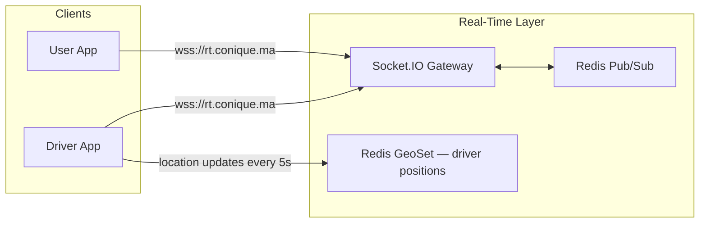
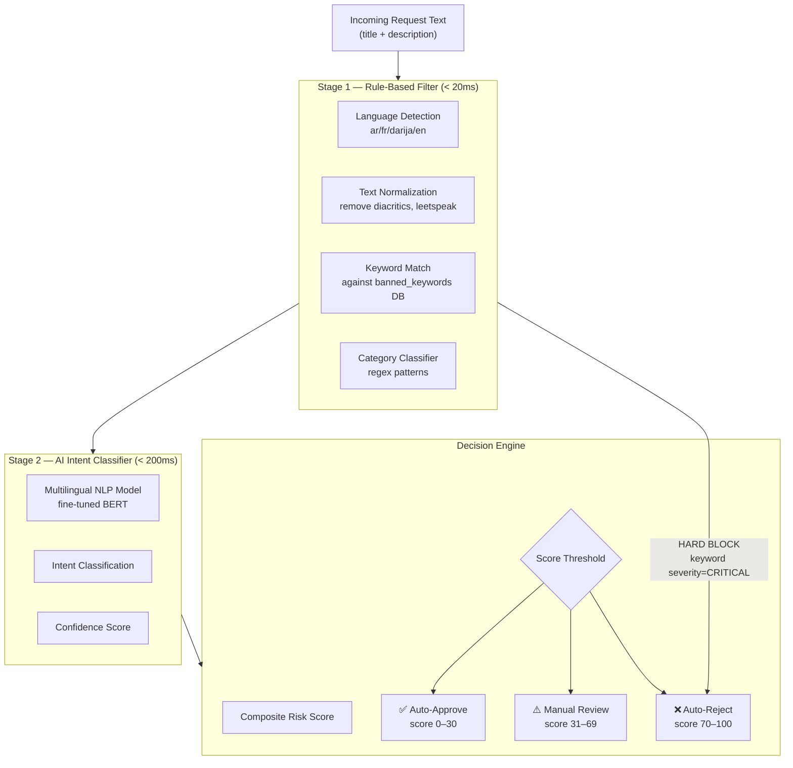
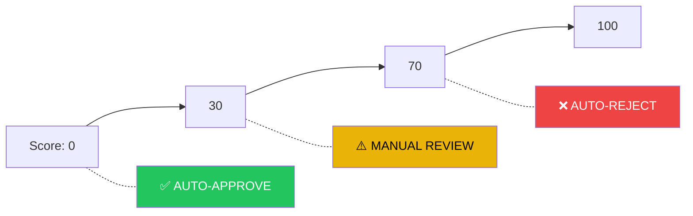
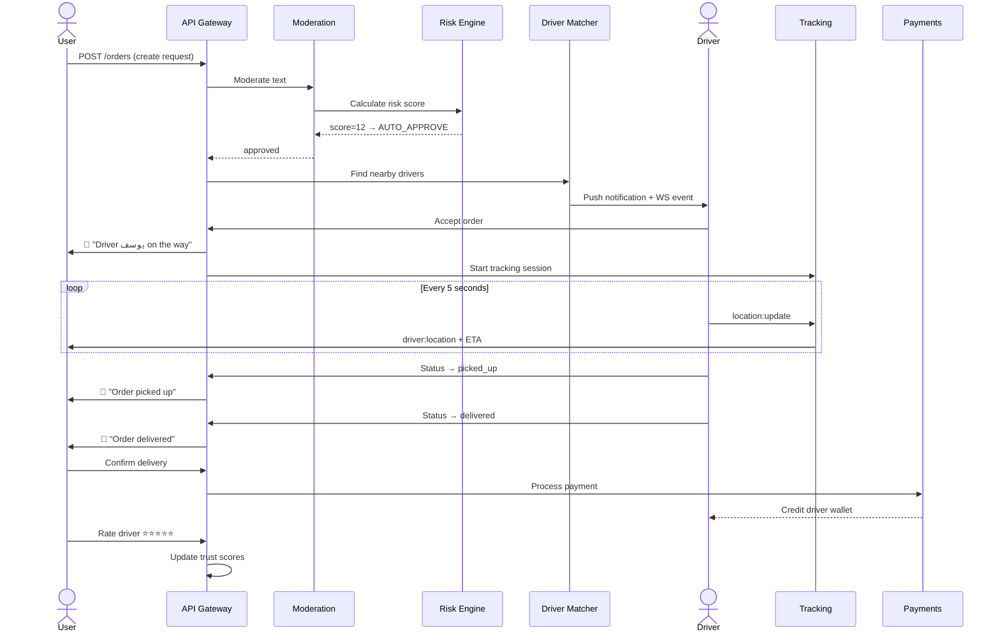
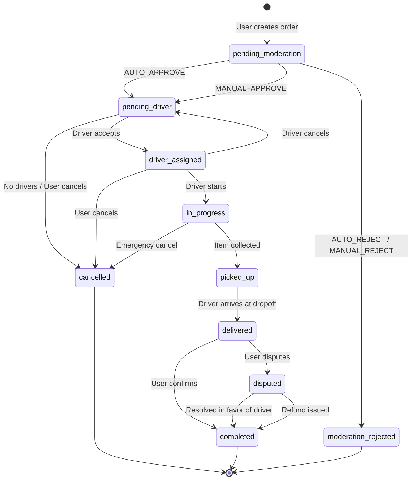
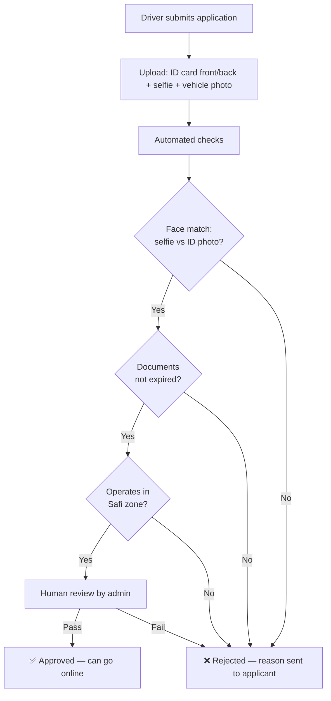

# Conique — Production System Design (Part 2)

> Real-Time · AI Moderation · Risk Scoring · Lifecycle · Security

---

## 4. Real-Time System

### 4.1 Architecture



### 4.2 WebSocket Events

| Direction | Event | Payload | Description |
|---|---|---|---|
| Driver → Server | `location:update` | `{lat, lng, speed, heading}` | Every 5 seconds while online |
| Server → User | `driver:location` | `{lat, lng, eta_minutes}` | Forwarded to order's user |
| Server → Driver | `order:new` | `{order_id, title, distance, price}` | New order broadcast |
| Driver → Server | `order:accept` | `{order_id}` | Driver claims order |
| Server → Both | `order:status` | `{order_id, status, timestamp}` | Status transitions |
| Both ↔ Both | `chat:message` | `{order_id, content, sender_role}` | In-order chat |
| Server → Both | `chat:flagged` | `{message_id, reason}` | Moderated message alert |

### 4.3 Driver Matching Algorithm

```
1. Query Redis GeoSet: GEORADIUS driver_positions <pickup_lng> <pickup_lat> 5 km
2. Filter: is_online=true AND no active_order AND is_approved=true
3. Score candidates:
     proximity_score  = 1 - (distance_km / 5)       × 0.40
     rating_score     = (rating_avg / 5)             × 0.30
     experience_score = min(total_deliveries/100, 1)  × 0.20
     idle_score       = min(minutes_idle / 30, 1)     × 0.10
4. Sort by composite_score DESC
5. Broadcast to top 5 drivers simultaneously
6. First to accept wins (atomic Redis lock)
7. If no accept in 30s → expand radius to 8km, repeat
8. After 3 rounds → notify user "No drivers available"
```

### 4.4 Live Chat System

- **Scope**: Each order gets a private chat channel `ch_{order_id}`
- **Participants**: user + assigned driver + system bot
- **Moderation**: Every message passes through a lightweight keyword scan (< 50ms)
- **Media**: Images uploaded to S3, URL shared in chat
- **Persistence**: All messages stored in `chat_messages` table for audit
- **Auto-messages**: System sends templates at status transitions:
  - `"🚗 السائق يوسف في الطريق إليك"` (Driver en route)
  - `"📦 تم استلام طلبك"` (Order picked up)

---

## 5. AI Moderation System

> [!IMPORTANT]
> This is the most critical safety layer. It operates as a **hybrid pipeline**: fast rule-based filters first, then AI classification for nuanced cases.

### 5.1 Pipeline Architecture



### 5.2 Stage 1 — Rule-Based Filtering

#### Keyword Database (multi-language)

| Word / Pattern | Language | Severity | Category |
|---|---|---|---|
| `مخدرات` / `drogue` | ar / fr | **CRITICAL** | drugs |
| `سلاح` / `arme` | ar / fr | **CRITICAL** | weapons |
| `حشيش` / `shit` / `hash` | darija / fr | **CRITICAL** | drugs |
| `كحول` / `alcool` / `bière` | ar / fr | **HIGH** | alcohol |
| `فلوس مزورة` | darija | **CRITICAL** | counterfeit |
| `بنت` / `fille` (in suspicious context) | ar / fr | **MEDIUM** | exploitation_risk |
| `documents` + `faux` | fr | **CRITICAL** | fraud |

> The keyword DB contains **500+ entries** across Arabic, French, Darija, and common Romanized Darija (Arabizi). Admins can add/remove keywords via dashboard.

#### Normalization Pipeline
1. **Transliterate Arabizi** → Arabic (`7ob` → `حب`, `3lach` → `علاش`)
2. **Remove diacritics** (tashkeel)
3. **Leetspeak decode** (`dr0gu3` → `drogue`)
4. **Expand abbreviations**
5. **Lowercase all Latin text**

### 5.3 Stage 2 — AI Intent Classifier

**Model**: Fine-tuned `bert-base-multilingual-cased` on a custom Moroccan delivery/errand dataset.

#### Intent Categories

| Intent Label | Description | Base Risk |
|---|---|---|
| `food_delivery` | Restaurant / prepared food | 0 |
| `grocery_shopping` | Supermarket / market run | 0 |
| `pharmacy_errand` | Medicine pickup | 5 |
| `document_delivery` | Delivering papers/documents | 10 |
| `personal_item_delivery` | Picking up personal items | 15 |
| `gift_delivery` | Sending gifts | 10 |
| `bill_payment` | Paying bills at agencies | 10 |
| `queue_waiting` | Standing in line for someone | 5 |
| `ambiguous_errand` | Cannot clearly classify | 40 |
| `suspicious_errand` | Possible policy violation markers | 65 |
| `illegal_activity` | Clear illegal intent detected | 90 |
| `exploitation_risk` | Possible human exploitation signals | 85 |

#### Confidence Handling
- `confidence ≥ 0.85` → Use AI classification directly
- `confidence 0.60–0.84` → AI classification + bump to manual review
- `confidence < 0.60` → Force manual review regardless of risk score

### 5.4 Moderation Decision Examples

````carousel
#### ✅ Example 1: Auto-Approved (score = 8)

**Request**: _"شراء أدوية من الصيدلية — Doliprane و Vitamine C"_

| Stage | Result |
|---|---|
| Keywords | None triggered |
| AI Intent | `pharmacy_errand` (confidence: 0.94) |
| Base risk | 5 |
| Context modifiers | +3 (new user, 2 orders) |
| **Final score** | **8** → ✅ Auto-Approve |
<!-- slide -->
#### ⚠️ Example 2: Manual Review (score = 52)

**Request**: _"جيب لي حاجة من عند صاحبي في المدينة القديمة"_
("Bring me something from my friend in the old medina")

| Stage | Result |
|---|---|
| Keywords | None triggered (no banned words) |
| AI Intent | `ambiguous_errand` (confidence: 0.72) |
| Base risk | 40 |
| Context modifiers | +8 (vague description), +4 (low confidence) |
| **Final score** | **52** → ⚠️ Manual Review |
| **Admin action** | Ask user to specify what "something" is |
<!-- slide -->
#### ❌ Example 3: Auto-Rejected (score = 95)

**Request**: _"بغيت شي واحد يجيب لي الشيرا من درب X"_
("I want someone to bring me hash from neighborhood X")

| Stage | Result |
|---|---|
| Keywords | `الشيرا` → CRITICAL (drugs) |
| **Decision** | **HARD BLOCK** at Stage 1 — no AI needed |
| **Final score** | **95** → ❌ Auto-Reject |
| **Side effects** | User trust_score −20, fraud flag created |
<!-- slide -->
#### ⚠️ Example 4: Clever Evasion Attempt (score = 72)

**Request**: _"7eb li dak l'article dial sahbi, howa 3arf ach kayn"_
(Arabizi: "Get me that stuff from my friend, he knows what it is")

| Stage | Result |
|---|---|
| Normalization | Arabizi → Arabic conversion |
| Keywords | None directly triggered |
| AI Intent | `suspicious_errand` (confidence: 0.81) |
| Base risk | 65 |
| Context modifiers | +7 (deliberate vagueness pattern) |
| **Final score** | **72** → ❌ Auto-Reject |
| **Flag** | Evasion pattern detected → user warning issued |
````

---

## 6. Risk Scoring Engine

### 6.1 Score Composition

The final risk score (0–100) is a weighted composite:

```
RISK_SCORE = (
    keyword_severity_score     × 0.30
  + ai_intent_base_risk        × 0.30
  + user_trust_modifier        × 0.15
  + contextual_signals         × 0.15
  + historical_pattern_score   × 0.10
)
```

### 6.2 Factor Breakdown

#### Factor 1: Keyword Severity (0–100)
| Severity | Score |
|---|---|
| CRITICAL hit | 100 (instant hard block) |
| HIGH hit | 70 |
| MEDIUM hit | 40 |
| LOW hit | 15 |
| No hits | 0 |

#### Factor 2: AI Intent Base Risk (0–100)
Mapped from intent label (see table in §5.3).

#### Factor 3: User Trust Modifier (−20 to +20)
```
trust_modifier = (50 - user.trust_score) × 0.4

Examples:
  trust_score=90 → modifier = (50-90)×0.4 = -16  (lowers risk)
  trust_score=70 → modifier = (50-70)×0.4 = -8
  trust_score=30 → modifier = (50-30)×0.4 = +8   (raises risk)
```

#### Factor 4: Contextual Signals (0–30)

| Signal | Points |
|---|---|
| Vague description (< 10 chars or no specifics) | +8 |
| Request at unusual hour (1am–5am) | +5 |
| Pickup in known high-risk zone | +7 |
| Very high value implied (> 500 MAD) | +5 |
| Uses obscuring language patterns | +7 |
| First-time user | +3 |
| Scheduled order (vs. immediate) | -3 |
| User has 20+ successful orders | -5 |

#### Factor 5: Historical Pattern (0–25)

| Pattern | Points |
|---|---|
| Previous rejected order in last 7 days | +10 |
| Previous fraud flag (unresolved) | +15 |
| 3+ cancelled orders in last 24h | +8 |
| Consistent category (grocery/food) | -5 |
| Clean history (50+ orders, 0 flags) | -5 |

### 6.3 Decision Thresholds



| Range | Action | SLA |
|---|---|---|
| **0–30** | Auto-approve, order goes to driver matching | Instant |
| **31–69** | Queued for admin. User notified "under review" | < 5 min |
| **70–100** | Auto-reject. User shown policy violation message | Instant |

### 6.4 Worked Scoring Example

> **User**: trust_score=65, 12 past orders, 0 flags, 8pm request
> **Request**: _"اشري لي 2 pizza من Domino's و جيبهم للدار"_

| Factor | Raw | Weight | Contribution |
|---|---|---|---|
| Keywords | 0 (none) | ×0.30 | 0.0 |
| AI Intent | `food_delivery` = 0 | ×0.30 | 0.0 |
| Trust mod | (50-65)×0.4 = −6 | ×0.15 | −0.9 |
| Context | 0 signals | ×0.15 | 0.0 |
| History | clean (−5) | ×0.10 | −0.5 |
| **Total** | | | **−1.4 → clamped to 0** |

→ ✅ Score = **0** — instant auto-approve.

---

## 7. Full Request Lifecycle

### 7.1 Happy Path



### 7.2 Edge Cases & Handling

| Edge Case | System Response |
|---|---|
| **No drivers available** | 3 rounds of expanding radius (5km → 8km → 12km). If none found, notify user with option to retry in 5 min or cancel. |
| **Driver cancels after accepting** | Penalize driver (trust −5). Re-broadcast to other drivers automatically. If 2nd cancellation on same order, offer user priority re-queue. |
| **User cancels after driver en route** | If driver already moved > 500m toward pickup: user charged 5 MAD cancellation fee. Driver compensated. |
| **Driver goes offline mid-delivery** | 3-minute grace period (network issues). If no reconnection → alert admin + notify user. Attempt to reassign. |
| **GPS spoofing detected** | Driver's location jumps > 2km in < 10s → flag `fake_gps`. Suspend driver pending review. |
| **Payment fails (card)** | Retry once. If still failing, downgrade to cash for this order. Flag for payment team. |
| **User disputes delivery** | Order moves to `disputed` status. Admin reviews chat logs + GPS trail. Resolution within 24h. Refund or confirmation. |
| **Moderation takes > 5 min** | Auto-escalate to senior admin. User offered option to modify request text. |
| **Driver reports unsafe situation** | Panic button → immediate admin alert + GPS snapshot. Order paused. Admin contacts both parties. |
| **Repeated rejections (same user)** | After 3 rejections in 24h: temporary 2h cooldown. After 5: account review. |

### 7.3 Order State Machine



---

## 8. Security & Legal Safeguards

### 8.1 Authentication & Authorization

| Control | Implementation |
|---|---|
| **Phone verification** | OTP via SMS (Twilio/Vonage) — required at signup |
| **JWT tokens** | Access token (15 min TTL) + refresh token (7 day, single-use rotation) |
| **Role-based access** | `user`, `driver`, `admin`, `super_admin` — enforced at Gateway |
| **Device fingerprinting** | Track device_id to detect multi-accounting |
| **Biometric** | Optional fingerprint/face unlock in mobile app |

### 8.2 Data Protection

| Requirement | Implementation |
|---|---|
| **Encryption at rest** | AES-256 on PostgreSQL (pgcrypto), S3 SSE |
| **Encryption in transit** | TLS 1.3 everywhere, certificate pinning in mobile apps |
| **PII handling** | Phone numbers hashed in logs, real numbers only in DB |
| **Data retention** | Chat: 90 days. GPS trails: 180 days. Financial: 7 years (Moroccan law) |
| **Right to deletion** | User can request account deletion; PII anonymized, transaction records kept |

### 8.3 Fraud Prevention Matrix

| Fraud Type | Detection Method | Response |
|---|---|---|
| **Fake GPS** | Speed/distance anomaly detection | Suspend driver, flag order |
| **Multi-accounting** | Device fingerprint + phone graph analysis | Block duplicate accounts |
| **Payment fraud** | Velocity checks (>5 txn/hour), card BIN analysis | Temporary hold, manual review |
| **Collusion** (user+driver) | Same delivery address + same driver pattern, unusually fast completions | Flag relationship, audit |
| **Rating manipulation** | Statistical outlier detection on review patterns | Remove fake reviews, warn user |
| **Promo abuse** | Coupon velocity, referral graph loops | Revoke promo, charge back |

### 8.4 Driver Verification Flow



### 8.5 Legal Compliance (Morocco)

| Area | Requirement | Implementation |
|---|---|---|
| **CNDP** (data privacy authority) | Register data processing activities | Data processing registry maintained |
| **Consumer protection** (Law 31-08) | Transparent pricing, cancellation rights | Clear pricing before checkout, cancel anytime pre-pickup |
| **Labor law** | Drivers are **independent contractors**, not employees | Contractor agreements, no hour minimums, driver sets availability |
| **Anti-money laundering** | Cash transaction monitoring | Daily cash limits (5000 MAD), suspicious pattern alerts |
| **Content liability** | Platform not liable if good-faith moderation in place | Full audit trail of moderation decisions |

### 8.6 Audit Trail

Every significant action is logged to an immutable audit log:

```json
{
  "event_id": "evt_9x2k4m",
  "timestamp": "2026-03-19T00:14:05Z",
  "actor": { "id": "u_1a2b3c", "role": "user" },
  "action": "order.create",
  "resource": { "type": "order", "id": "ord_x7k9m2" },
  "context": {
    "ip": "105.158.xxx.xxx",
    "device_id": "dev_m3n7p",
    "gps": { "lat": 32.305, "lng": -9.228 }
  },
  "moderation": {
    "risk_score": 8,
    "decision": "auto_approve",
    "rules_triggered": []
  }
}
```

> [!NOTE]
> Audit logs are written to Elasticsearch with a **write-once policy** (no updates/deletes). Retention: 2 years. Accessible only by `super_admin` role.

---

## 9. Deployment & Scaling Strategy

| Component | Strategy |
|---|---|
| **API Services** | Kubernetes pods, auto-scale 2–10 replicas based on CPU/request rate |
| **PostgreSQL** | Primary + 2 read replicas. Daily automated backups to S3 |
| **Redis** | Cluster mode (3 nodes) for high availability |
| **WebSocket Gateway** | Sticky sessions via Redis adapter, horizontal scale |
| **AI/NLP Service** | GPU-backed pod (1× T4), scale to 2 during peak hours (12pm–2pm, 7pm–10pm) |
| **CDN** | Cloudflare for static assets + API edge caching |
| **Monitoring** | Prometheus metrics → Grafana dashboards. PagerDuty for P0 alerts |

### Key SLAs

| Metric | Target |
|---|---|
| API response time (p95) | < 200ms |
| Moderation decision time | < 500ms (auto) / < 5 min (manual) |
| Driver matching time | < 15s |
| System uptime | 99.9% |
| Order tracking latency | < 1s |
