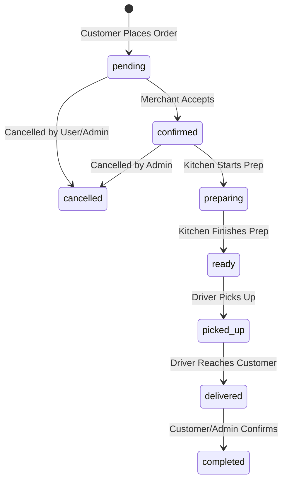

# ORDER STATE MACHINE

This document defines the strict, authoritative order and payment status lifecycles enforced by the backend server. All client-side direct state updates are blocked, and the backend validates every requested transition to prevent out-of-order execution, replays, or unauthorized modifications.

---

## 1. Allowed Order Status Transitions

The order status state machine only permits the following forward transitions. Any other status transitions will be rejected with a `409 Conflict` error at the backend layer.



### Transition Matrix & Rules

| From Status | To Status | Allowed Actor | Trigger Event / Endpoint |
|---|---|---|---|
| `pending` | `confirmed` | Admin / Store | `PATCH /admin-api/orders/:id` |
| `pending` | `cancelled` | Customer / Admin | `POST /admin-api/v1/orders/:id/cancel` |
| `confirmed` | `preparing` | Admin / Store | `PATCH /admin-api/orders/:id` |
| `confirmed` | `cancelled` | Customer / Admin | `POST /admin-api/v1/orders/:id/cancel` |
| `preparing` | `ready` | Admin / Store | `PATCH /admin-api/orders/:id` |
| `ready` | `picked_up` | Driver | `POST /admin-api/driver/orders/:id/stage` |
| `picked_up` | `delivered` | Driver | `POST /admin-api/driver/orders/:id/stage` |
| `delivered` | `completed` | Customer / Admin | `POST /admin-api/v1/orders/:id/complete` |

### Guard Rules:
- **No Backward Transitions:** Once an order is `picked_up`, it can never go back to `preparing` or `confirmed`.
- **Cancellation Lock:** Orders in states `picked_up`, `delivered`, or `completed` cannot be cancelled.
- **Terminal States:** `completed` and `cancelled` are terminal. No further transitions are allowed.

---

## 2. Payment Status Transitions

Allowed transitions for payment status:

```
                  ┌──────────────┐
                  │    paid      │
           ┌─────►│  (Terminal)  │
           │      └──────────────┘
    ┌──────┴───┐
    │ pending  │
    └──────┬───┘
           │      ┌──────────────┐      ┌──────────────┐
           └─────►│ cod_pending  ├─────►│cod_collected │
                  │  (On Delivery)│      │  (Terminal)  │
                  └──────────────┘      └──────────────┘
```

### State Definitions & Transitions:
1. **`pending` → `paid`**:
   - Triggered when card payment is successfully authorized (e.g., Stripe, CMI, or Payzone webhooks/APIs).
2. **`pending` → `cod_pending`**:
   - Automatically set upon order confirmation for Cash on Delivery (COD) orders.
3. **`cod_pending` → `cod_collected`**:
   - Triggered when the driver collects the cash at the doorstep and submits the delivery confirmation.

*Note: Clients can never modify `payment_status` directly. This state is computed and written exclusively by backend endpoints.*
