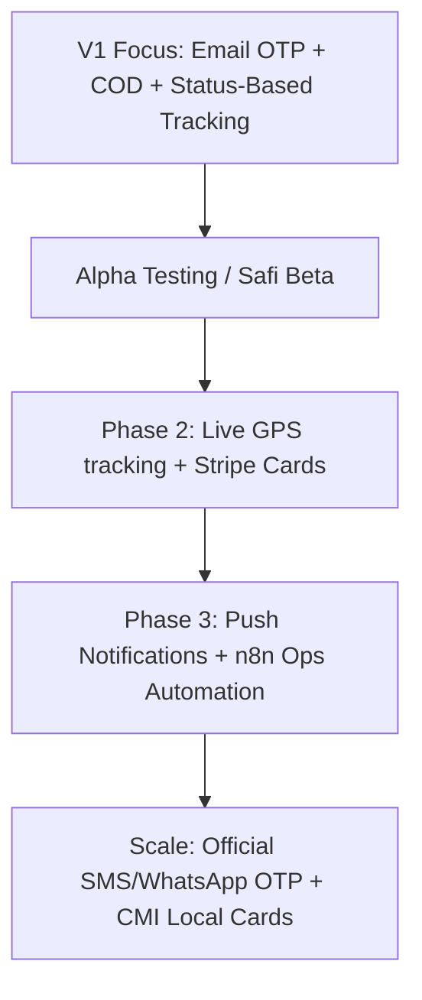

# TOOLS AND SERVICES STRATEGY — JAHEEZ (جاهز)

This document defines the tooling, hosting, integration, and service strategy for JAHEEZ, emphasizing cost-effectiveness, simplicity for early-stage deployment, and rapid AI-assisted development.

---

## 1. Purpose
The purpose of this strategy is to establish a **low-cost, high-efficiency tooling roadmap** for JAHEEZ that ensures developers do not get blocked by expensive APIs, complex setups, or fragile unofficial automations. It divides the technical requirements into what is needed **now (V1/MVP)** versus what should be implemented **later (Production/Scale)**.

---

## 2. Cheap/Best Tools Summary Table

| Category | Recommended Tool (V1/MVP) | Future Production Tool | Cost Profile (V1) | Purpose / Context |
| :--- | :--- | :--- | :--- | :--- |
| **Mobile App** | Expo SDK 55 + Router v3 | EAS Build + Submit | Free | Cross-platform Android/iOS mobile client |
| **Backend/DB** | Supabase Free Tier | Supabase Pro | $0 / Free Tier | Auth, Postgres, Storage, Realtime, RLS |
| **OTP Auth** | Supabase Email OTP | Official SMS / Twilio WA | $0 / Free Tier | Avoids expensive/unstable SMS gateways in V1 |
| **Operations** | Manual WhatsApp Biz | WhatsApp API + n8n | Free | Driver, operator, and customer communications |
| **Hosting (Web)**| Vercel | Vercel Pro | Free | Frontend Admin Panel hosting |
| **Hosting (API)**| Render Free Tier | Render Starter ($7/mo) | Free | Express Admin API Node server (if needed) |
| **Payments** | Cash on Delivery (COD) | Stripe / CMI / PayZone | Free | Primary payment method for Moroccan market |
| **Maps & GPS** | Status-Based Tracking | react-native-maps + GPS | Free | Timeline status steps before live driver map |
| **Notifications** | Status in-app polls | Expo Notifications (FCM) | Free | Keep users notified of order statuses |
| **UI/Animation** | Reanimated + Moti + Lottie | Skia (optional) | Free | High-fidelity interactive mobile experience |
| **Design/Assets** | Figma Free + Photopea | Vectorizer.ai + Squoosh | Free | Mockup organization and asset pipeline |
| **Monitoring** | Console Logging | Sentry Free Plan | Free | Error tracking and crash reporting |
| **Testing/QA** | TypeScript + Manual Checklist| Jest + Playwright | Free | Maintain code quality without blocking dev speed |

---

## 3. Recommended V1 Stack (Current Focus)
- **Core Mobile:** Expo SDK 55 + React Native 0.83 (TypeScript strict)
- **Navigation:** Expo Router v3 (file-based)
- **State Management:** Zustand (local & persisted AsyncStorage) + React Query (server-side caching)
- **Forms & Validation:** React Hook Form + Zod
- **Backend Infrastructure:** Supabase (Database, Auth, Storage, Realtime, RLS)
- **Payments:** Cash on Delivery (COD) only.
- **Auth Flow:** Email-based OTP codes (6-digit codes sent via Supabase Auth email templates).
- **Communication:** Manual WhatsApp links for driver assignment & customer service.
- **Web Admin Hosting:** Vercel (free tier deployment connected to GitHub repository).

---

## 4. Recommended Production Stack (Future Scale)
- **Mobile Builds:** EAS (Expo Application Services) for automated App Store and Play Store releases.
- **SMS / WhatsApp Auth:** Twilio / Infobip API integration for SMS-based phone OTP auth, or Twilio WhatsApp Business API.
- **Payments:** Stripe integration (for cards where supported) + CMI/PayZone/CashPlus integrations for local Moroccan gateway cards.
- **Live Maps:** Google Maps API + `react-native-maps` for live vehicle pins.
- **Notifications:** Expo Notifications connected to Google Firebase (FCM) and Apple Push Notification Service (APNs).
- **Advanced Graphics:** React Native Skia for complex canvas-rendered maps and dashboards.
- **Error Tracking:** Sentry React Native SDK for crash reporting.
- **Infrastructure Automation:** n8n workflow builder + OpenWA (open-source WhatsApp automate helper) for operations backend alerts only.

---

## 5. OTP / Auth Strategy

> [!WARNING]
> Do NOT rely on Supabase Email confirmation Magic Links for mobile applications. If the redirect URL is wrongly configured, it will point to `localhost` or fail inside mobile deep links. 

### V1 Setup (Email OTP)
1. **User Auth:** User registers with their email, full name, and phone number.
2. **Database Storage:** Phone number is saved as a verified/unverified text string in the user's profile table, not as the primary auth identity provider.
3. **Authentication Code:** Supabase sends a **6-digit numeric OTP code** via email.
4. **App Entry:** User enters the code directly into the app's `otp.tsx` screen.
5. **App Verification:** App verifies the code using `supabase.auth.verifyOtp({ type: 'signup' | 'recovery' })`.

### WhatsApp OTP Restrictions
- **Do NOT** use unofficial WhatsApp automation tools (like OpenWA or WhatsApp Web scrapers) for login or authentication OTPs. These tools are fragile, violate WhatsApp's terms of service, and can result in banned numbers.
- **Future SMS / WhatsApp OTP:** SMS or WhatsApp OTP should only be integrated using official, provider-approved setups (such as Supabase + Twilio WhatsApp or Infobip SMS).

---

## 6. WhatsApp Operations Strategy

For V1/MVP, JAHEEZ will use WhatsApp manually to avoid high service integration fees while maintaining a close relationship with users.

### manual WhatsApp Operations (V1)
- **Customer Support:** Provide a prominent "Contact Support" button in the app that links directly to the operator's WhatsApp Business app (`https://wa.me/212xxxxxxxxx?text=...`).
- **Errand Details:** Allow operators to copy errand details from the Admin Panel and send them manually to drivers via WhatsApp.
- **Driver Onboarding:** Drivers submit documents through a form; admins contact them manually via WhatsApp to verify.

### WhatsApp Automation Constraints
- **What to automate (Future):** Internal alerts (e.g., notifying the admin group that an order was flagged as high-risk, sending delivery summaries to operators via n8n).
- **What NOT to automate:** Never automate authentication, password resets, payment confirmation, or critical security details using unofficial channels.

---

## 7. Backend Strategy
JAHEEZ uses **Supabase** as its primary backend, database, and files storage layer to minimize infrastructure costs and speed up initial development.

- **Postgres Database:** Single source of truth. All relations, indexes, and triggers reside here.
- **Supabase Auth:** Handles session persistence, user management, and JWT validation.
- **Row-Level Security (RLS):** Secures all data directly at the database level. Mobile clients communicate directly with Supabase, executing queries within the limits of RLS policies.
- **Storage Buckets:** Stores store banners, menu item images, and driver onboarding documents (`/avatars`, `/stores`, `/verifications`).
- **Edge Functions:** Reserved for future AI moderation (Gemini API) and backend calculations (matching driver distance) if Express.js server capacity is exceeded.

---

## 8. Hosting Strategy

- **Admin Frontend:** Hosted on **Vercel** (Free Tier). Deploys automatically on git pushes.
- **Admin API / Node Server:** Hosted on **Render** (Free Tier) if a dedicated Express backend (such as `scripts/admin-api.js`) is needed. Note that Render Free tier spins down after 15 minutes of inactivity; we will structure the client to handle slow cold starts.
- **Backend / DB / Files:** Hosted on **Supabase** (Free Tier, 500MB DB limit, which is sufficient for beta testing in Safi).
- **Mobile Builds:** Local packaging during development; **EAS** (EAS Build) for staging and production builds.

---

## 9. Payment Strategy

Morocco is primarily a cash-first economy for local deliveries. Cash on Delivery is the highest priority payment option.

- **Cash on Delivery (COD) (V1 Priority):**
  - Order flow accepts COD.
  - Driver collects cash at delivery point.
  - Reconciliation recorded in Admin Panel (`pages/cod-reconciliation.tsx`).
- **Moroccan Cards (Future):**
  - Integrated later using local payment processors (CMI, PayZone, or local wallets like CashPlus) to handle local credit/debit cards.
- **Stripe (Future):**
  - Used for international cards or wallet setups once core order flows are stable.

---

## 10. Maps / Tracking Strategy

Live GPS driver location tracking is not a prerequisite for launch. A robust status-based timeline is more cost-effective and faster to implement.

### Status-Based Tracking (V1)
- **UI:** A progress stepper timeline (`components/ui/ProgressTimeline.tsx`) displaying:
  1. `order_received` (Order submitted)
  2. `confirmed` (Store accepted order)
  3. `preparing` (Food/items being prepared)
  4. `on_the_way` (Driver has picked up items)
  5. `delivered` (Driver reached user)
- **Backend updates:** Drivers manually tap status buttons in the Driver App, which updates the `orders` status in Supabase. The User App listens via React Query or Supabase Realtime subscriptions.

### Live GPS Maps (Future)
- Integrated using Google Maps API for geocoding and `react-native-maps` for plotting coordinates.
- Driver app broadcasts coordinates every 15s to `driver_locations` table using Supabase Realtime.

---

## 11. Push Notification Strategy
- **V1:** In-app polling and banner alerts. When the user has the app open, we check status changes and show banners.
- **Future:** **Expo Notifications** integrated with Firebase Cloud Messaging (FCM) for Android and Apple Push Notification service (APNs) for iOS. No notifications will be added until core order and auth flows are 100% stable.

---

## 12. Animation / UI Tooling Strategy

Visual aesthetics are critical for the premium feel of JAHEEZ. Emojis must not be used as final icons.

- **Animations:**
  - `react-native-reanimated` for smooth gesture-based screen elements (like sheet gestures and cart items swipe-to-delete).
  - `Moti` for simple entry and exit transitions of UI cards and inputs.
  - `Lottie` for premium vector animations (such as the loading circle, success checkmark, and tracking delivery scooter).
- **Gradients:** `expo-linear-gradient` for branded backgrounds.
- **Images:** `expo-image` for high-performance image caching, placeholders, and memory management.
- **Icons:** Custom SVGs via `react-native-svg` and `@expo/vector-icons` (Ionicons/MaterialIcons).

---

## 13. Design / Asset Tooling Strategy
- **Figma (Free):** Organize screen flow mockups.
- **Vectorizer.ai:** Turn raster logos/illustrations into clean, scalable SVG paths.
- **Google Stitch / Gemini Image:** For UI/UX layout references and illustrations.
- **Squoosh / TinyPNG:** Compress all PNGs/WebPs before compiling. Max image file size for store menus and profiles is capped at 1MB.

---

## 14. Monitoring / Testing Strategy
- **Staging / Beta:** Sentry's free tier will capture unhandled React Native exceptions.
- **Code Assurance:** TypeScript compiler strict check (`tsc --noEmit`) and manual QA testing checklists before staging releases. No heavy Jest or Playwright pipelines are required during initial feature construction.

---

## 15. Summary of What to Use Now vs Later

### What to Use Now
- Supabase Auth + Email OTP (6 digits)
- Cash on Delivery (COD) order payment option
- Status-based stepper timeline for order tracking
- Manual WhatsApp contact links
- React Native StyleSheet + brand.ts tokens

### What to Use Later
- Official Twilio SMS/WhatsApp OTP
- Stripe & Moroccan card gateways
- Live GPS driver map tracking
- APNs / FCM push notifications
- Sentry error monitoring

### What NOT to Use Yet
- Unofficial WhatsApp automation scrapers (OpenWA/WAWeb JS) for auth
- Paid SMS APIs during the local dev/testing phase
- Complex testing suites that slow down feature addition
- TailwindCSS on React Native (unless NativeWind is explicitly requested)

---

## 16. Tool Risk Notes

- **Render Free Tier Cold Starts:** Spin-downs cause up to a 50s delay on requests.
  - *Mitigation:* Ensure admin panels show a detailed loader with a friendly message if the API takes time to wake up.
- **Supabase Free Tier Inactivity:** Databases with no active connections are paused after 1 week.
  - *Mitigation:* A simple cron/heartbeat script or active development maintains connections.
- **Google Maps API Billing:** Live maps run up high costs quickly.
  - *Mitigation:* Strict billing caps and geocoding query caches inside the database.

---

## 17. Tool Roadmap

---

**Created:** 2026-05-20 | **Method:** Spec alignment & low-cost planning | **Confidence:** High
