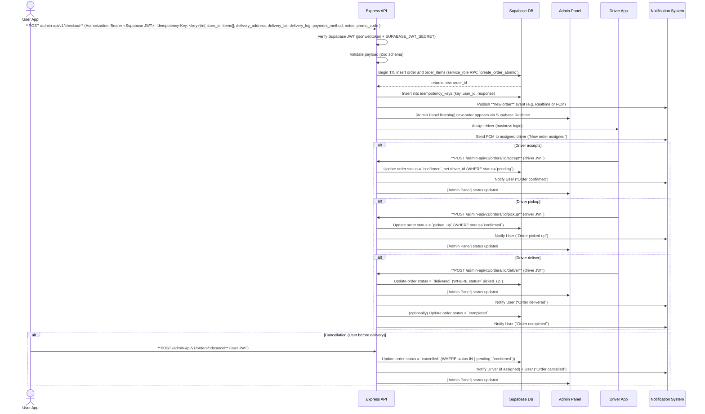

# End-to-End Order Integration: JAHEEZ Platform

JAHEEZ uses an Expo/React Native **User App**, a **Driver App**, and a React Admin Panel, all backed by a monolithic Express server (`scripts/admin-api.js`) and a Supabase PostgreSQL database with RLS. The goal is a secure, server-authoritative checkout and synchronized order flow. We assume **no OTP/KYC for drivers** in this phase (removed), an **idempotency key TTL of 24h**, and that **cancelled orders remain in DB** (status = `cancelled`). 

Below is a comprehensive integration specification, including sequence diagrams, API design, database schema/RLS, notification flows, concurrency analysis, testing plan, deployment strategy, code snippets, and security considerations.

---

### 3. Admin Panel
- **API client ([adminApi.ts](file:///c:/Users/user/Desktop/jaheeez/Jaheez-v1/admin/src/lib/adminApi.ts)):** Updated `adminCreateDriver` to pass additional fields (`cin`, `password`, `vehiclePlate`, `city`, and `isVerified`).
- **Driver management UI ([drivers.tsx](file:///c:/Users/user/Desktop/jaheeez/Jaheez-v1/admin/src/pages/drivers.tsx)):**
  - Added password and CIN input fields to the driver creation/editing dialog, making the password field mandatory when creating a new driver.
  - Added a **Statut** dropdown (Active / Suspended) to provision drivers as active or suspended directly.
  - Added inline **Valider/Activer** (CheckCircle) and **Suspendre** (Ban) actions to quickly activate or suspend drivers from the table.
  - Displayed the driver's CIN in the list alongside their phone number.
  - Updated the status badge calculation to correctly reflect active/suspended/pending states using the retrieved `is_verified` and `kyc_status` properties.
  - Correctly implemented and supported all filters (`verified`, `suspended`, `online`, `pending`) across the frontend list and backend query engine.

---

## 1. Order Lifecycle Sequence Diagrams

The order lifecycle spans the User App, Express API, Database, Admin Panel, Driver App, and Notification system. The main happy path and cancellation flows are shown below in Mermaid sequence diagrams. 



*Above:* The user’s checkout request is handled atomically. The server recalculates prices and inserts the order in a single transaction (via a `create_order_atomic` RPC or transaction), then records the idempotency key. Notifications (via Supabase Realtime or server-side push) propagate updates to the Admin Panel, the driver, and the user. Cancellation is only allowed while status is `pending` or `confirmed`, rejecting otherwise. 

---

## 2. API Endpoints and Schemas

All requests use RESTful HTTP. “Supabase JWT” means the user’s auth token; “Admin JWT” means the server’s admin token (`ADMIN_JWT_SECRET`). Below are the required endpoints:

| Method | Path                               | Auth              | Headers                         | Request Body                                                    | Response Body                                   | Errors (HTTP)                                |
|--------|------------------------------------|-------------------|---------------------------------|-----------------------------------------------------------------|-------------------------------------------------|----------------------------------------------|
| **POST**  | `/admin-api/v1/checkout`              | **Supabase JWT**  | Authorization: Bearer <user_jwt><br>Idempotency-Key: <UUID> | JSON: `{ store_id: UUID, items: [{menu_item_id: UUID, quantity: int}], delivery_address: string, delivery_lat?, delivery_lng?, payment_method: 'cash'|'card', notes?, promo_code? }` | JSON: `{ order_id: UUID, reference: string, total_amount: number, status: 'pending' }` | 401 (unauth), 400 (validation), 409 (duplicate key), 403 (store closed), 500 |
| **POST**  | `/admin-api/v1/orders/:id/cancel`     | **Supabase JWT**  | Authorization: Bearer <user_jwt> | none                                                            | `{ ok: true }`                                   | 401, 404 (not found), 409 (invalid state), 403|
| **POST**  | `/admin-api/v1/orders/:id/accept`     | **Driver JWT**    | Authorization: Bearer <driver_jwt> | none                                                            | `{ ok: true }`                                   | 401, 404, 409 (invalid state), 403            |
| **POST**  | `/admin-api/v1/orders/:id/pickup`     | **Driver JWT**    | Authorization: Bearer <driver_jwt> | none                                                            | `{ ok: true }`                                   | 401, 404, 409, 403                           |
| **POST**  | `/admin-api/v1/orders/:id/deliver`    | **Driver JWT**    | Authorization: Bearer <driver_jwt> | none                                                            | `{ ok: true }`                                   | 401, 404, 409, 403                           |
| **POST**  | `/admin-api/v1/orders/:id/complete`   | **Admin JWT**     | Authorization: Bearer <admin_jwt>  | none                                                            | `{ ok: true }`                                   | 401, 404, 409, 403                           |

- **Auth:** Endpoints distinguish user vs driver vs admin tokens. All should be Bearer JWT. 
- **Idempotency-Key:** Required on `/checkout` only. It must be a UUID per user session (TTL 24h). Same key → same response (as stored in `idempotency_keys`).
- **Request Body:** Shipped JSON with required fields. Validate strictly (e.g. item array length, field formats).
- **Response Body:** Include relevant info (order id, reference code, status, totals).
- **Errors:** 
  - `401 Unauthorized` if no/invalid token. 
  - `400 Bad Request` for schema validation errors (Zod check fails, e.g. invalid item ID format or quantity). 
  - `403 Forbidden` if action not allowed (e.g. cancel after pickup). 
  - `409 Conflict` if request violates state (e.g. duplicate idempotency key, invalid transition). 
  - `404 Not Found` if order or menu item doesn’t exist. 
  - `500` for internal errors.

*(No endpoint allows direct client insert into `orders` or `order_items` – those are protected by RLS.)*

---

## 3. Database Schema & RLS Policies

**Key Tables:** The checkout flow involves (at least) the following tables:

- **orders:** Columns like `id (PK)`, `user_id (UUID)`, `store_id (UUID)`, `delivery_address`, `delivery_lat`, `delivery_lng`, `notes`, `subtotal`, `delivery_fee`, `discount`, `total_amount`, `status` (e.g. `pending, confirmed, picked_up, delivered, completed, cancelled`), `payment_status`, `payment_method`, timestamps.  
- **order_items:** Columns `id (PK)`, `order_id (FK)`, `menu_item_id (UUID)`, `quantity (int)`, `unit_price`, `total_price`.  
- **idempotency_keys:** Columns `key (TEXT PK)`, `user_id (UUID FK)`, `response (JSONB)`, `created_at (timestamp)`.  
- **drivers:** Columns `id (PK)`, `user_id (UUID FK)`, `current_order_id`, `status` (e.g. `available, busy`), plus `lat`, `lng` if tracked.  
- **notifications:** (If used) e.g. `id, user_id, payload, read, created_at`. Not strictly required if using Realtime.

**RLS Policies:** All client **write** policies on `orders`, `order_items`, `wallets`, etc. must be dropped. Only the server (service role) inserts/updates. We enable **SELECT** policies to prevent data leakage:

- On `orders`: allow **SELECT** only if the row belongs to the user, or the user is the assigned driver. For example, 
  ```sql
  CREATE POLICY orders_user_select ON public.orders 
    FOR SELECT USING (auth.uid() = user_id);
  CREATE POLICY orders_driver_select ON public.orders 
    FOR SELECT USING (EXISTS (
        SELECT 1 FROM public.drivers d 
         WHERE d.id = public.orders.driver_id 
           AND d.user_id = auth.uid()
    ));
  ``` 
  This mirrors Supabase’s example of enforcing `auth.uid() = user_id`. No client can `INSERT` or `UPDATE` on orders – only the server’s `service_role` can, via RPC or direct queries.  
- On `order_items`: allow **SELECT** only through the parent order, e.g.: 
  ```sql
  CREATE POLICY order_items_user_select ON public.order_items 
    FOR SELECT USING (
      EXISTS (
        SELECT 1 FROM public.orders o 
         WHERE o.id = order_items.order_id 
           AND o.user_id = auth.uid()
      )
    );
  ``` 
- On `drivers`: if driver info is ever fetched, allow each driver user to view their row (`auth.uid() = user_id`).  
- On `idempotency_keys`: no client access (only service_role).  
- On `notifications`: if used, allow each user to read their own notifications (`auth.uid() = user_id`).  

By enabling RLS **before** publishing, all client-level database access requires passing these policies. This ensures **defense in depth** so that only the Express API (with service_role) can mutate orders or read/write idempotency keys.

---

## 4. Notification Design

We must notify **User**, **Driver**, and optionally **Admin** of order events. Possible channels:

- **Supabase Realtime:** Use the built‑in Realtime engine for in-app notifications/updates. For example, the Admin Panel (or apps) can subscribe to `orders` table changes via Supabase’s Realtime listeners (Postgres Realtime). When a new row is inserted or updated, clients see updates instantly. This covers in-app updates (e.g. admin dashboard or user UI showing order status changes).  
- **Push Notifications (FCM):** For out-of-app notifications, use Firebase Cloud Messaging. The Express server (or a Supabase Edge Function) sends FCM when events happen: e.g. order confirmed, picked up, delivered, or cancelled. Follow Supabase guidance to integrate FCM (e.g. via an Edge Function triggered by a DB webhook on a “notifications” table). For example, when an order is assigned, the server could insert a row into `notifications(driver_id, payload)`, triggering a webhook that calls an Edge Function to send FCM to the driver. Similarly, user notifications (order updates) can be sent via FCM if the user has push enabled.  
- **Webhooks/Edge Functions:** As suggested by Supabase community, set up a DB trigger or webhook: on INSERT into a `notifications` table, invoke an Edge Function that looks up target user’s FCM token and sends a push. This decouples the notification sender from the main transaction.  

**Payload Formats:** Define JSON payloads for each recipient type:
- **User (FCM):** e.g. `{ "type": "order_update", "order_id": "...", "status": "picked_up", "title": "Your order is on the way!" }`.  
- **Driver (FCM):** e.g. `{ "type": "new_order", "order_id": "...", "pickup": "...", "delivery": "..." }`.  
- **Admin (Realtime/Web):** e.g. `{ "type": "order_new", "order_id": "..." }` or just rely on UI subscription.  

**Retry/Backoff:** If a push fails (FCM returns error), implement retry with exponential backoff (e.g. retry up to 3 times). For Realtime DB events, data is persistent so missing a live update is tolerable on reconnect.  

**Delivery Guarantees:** Aim for at-least-once delivery. Idempotency helps: if we accidentally notify twice (e.g. due to retry), the UI can handle duplicates gracefully by checking the order status. For critical flows (like payment), ensure idempotency on processing (already covered by checkout idempotency).  

**Test Cases:** 
- Simulate user and driver subscriptions to ensure they get updates.  
- Verify FCM payload formats for each event.  
- Test offline behavior (reconnect and confirm updates catch up).  
- For example, insert a fake notification row and ensure the Edge Function fires. 
- Ensure cancellations notify both user and driver.

---

## 5. Concurrency & Race Conditions

Key potential races and fixes:

- **Duplicate Checkout Requests:** The same user might retry `/checkout` if network is flaky. Use the **Idempotency-Key** table to prevent double-orders. On the first request, store `(user_id, key, response)`. On retry, detect the same key and return the stored response without re-creating the order. (Keys should expire after ~24h to avoid infinite storage.)  

- **Simultaneous Driver Accept:** If two drivers try to accept the same order, only one should succeed. Implement the accept update as a transaction or use `UPDATE ... WHERE status='pending'` and check affected rows. The first update (setting status=`confirmed` and driver_id) locks the row; the second attempt will see no `pending` order and can return a 409 Conflict (“already accepted”).  

- **Cancel vs. Accept:** If a user cancels an order at the same time a driver accepts it, only one should win. For example, in the cancellation endpoint, do `UPDATE orders SET status='cancelled' WHERE id=$1 AND status IN ('pending','confirmed') RETURNING *`. If a driver just accepted (status=`confirmed`), cancellation should either fail (if you consider it too late) or succeed but then inform the driver. Define a clear rule: *Either* disallow cancellation once confirmed (simpler: only allow when pending) *or* allow but notify driver. For simplicity, treat cancel after driver accept as invalid (409).  

- **Pickup/Delivery:** Ensure a driver cannot mark *delivered* before *picked_up*. Do `UPDATE ... WHERE status='picked_up'` for delivery, returning 0 rows otherwise. The server should respond 409 if the order isn’t in the expected state.  

- **Concurrent Updates:** Use Postgres transactions (with SERIALIZABLE or at least REPEATABLE READ isolation) or explicit row-level locks (`SELECT ... FOR UPDATE`) around status changes to avoid lost updates. In practice, performing the `UPDATE` with a `WHERE status=...` clause (as above) is sufficient atomic check-and-set.  

- **Data Consistency:** Always recalc prices/fees on server. Never trust client totals. If orders or items change (e.g. store closes or price changes), subsequent operations should validate the current values from the DB.  

In summary, wrap state transitions in atomic operations/transactions and use idempotency to guard against retries. Validating state in the `WHERE` clause prevents invalid transitions.

---

## 6. Test Plan & Scripts

We must verify the integration end-to-end. Tests should be automated (e.g. Node.js scripts using `axios` or `fetch`). Key scenarios:

1. **Unauthorized Access:** Call each endpoint without `Authorization` header (or with malformed token) – expect `401 Unauthorized`.  
2. **Tampered JWT:** Use a decoded supabase JWT but tamper a claim. The server’s `jsonwebtoken.verify(token, SUPABASE_JWT_SECRET)` should catch this – expect `401`.  
3. **Invalid Payload:** Try POST `/checkout` with missing fields or menu_item_id that doesn’t exist – expect `400 Bad Request`.  
4. **Fake Prices:** Craft items payload with bogus `unit_price` fields. The server must ignore any client prices and use DB prices. Verify that the response `total_amount` matches the sum of *DB-retrieved* prices, not the fake ones.  
5. **Idempotency:** Use a fixed `Idempotency-Key` (e.g. same UUID) for two identical checkout requests. The first should succeed; the second should return the *same* `{ order_id, ... }` without creating a new order. Verify the database has only one order row.  
6. **Closed Store:** Attempt checkout on a store marked “closed” (if such a flag exists) – expect `403` or `400`. (If no store status in model, skip.)  
7. **Invalid State Transitions:**  
   - Cancel an order that is already `delivered` or `completed` – expect `409 Conflict`.  
   - Driver `pickup` when order is still `pending` – expect `409`.  
8. **Driver Flow:** Place a valid order, then simulate driver accepting, picking up, delivering in sequence. After each step, confirm the order’s status in Supabase and that notifications were sent.  
9. **Notification Delivery:** Mock a driver and user with test push tokens (or subscribe with Realtime) and ensure they receive each expected notification.  
10. **Direct Supabase Bypass:** Attempt a direct Supabase client `INSERT` into `orders` using an *authenticated* user token (e.g. via supabase-js). With RLS, this should fail (`403 Forbidden` or no effect). This confirms write policies are locked down.  

**Example Test Command (Node):**  
```js
const axios = require('axios');
const SUPABASE_JWT = 'ey...'; // obtained from login
// 1. No JWT -> expect 401
await axios.post('/admin-api/v1/checkout', { /* ... */ })
  .catch(err => console.assert(err.response.status === 401));
// 2. Valid checkout
const response = await axios.post('/admin-api/v1/checkout', payload, {
  headers: { 
    Authorization: `Bearer ${SUPABASE_JWT}`, 
    'Idempotency-Key': '123e4567-e89b-12d3-a456-426614174000' 
  }
});
console.assert(response.data.order_id);
// 5. Idempotency: same key again
const resp2 = await axios.post('/admin-api/v1/checkout', payload, {
  headers: { Authorization:`Bearer ${SUPABASE_JWT}`, 'Idempotency-Key':'123e4567-e89b-12d3-a456-426614174000' }
});
console.assert(resp2.data.order_id === response.data.order_id); // same order
```  
Include tests for each step (accept, pickup, deliver, cancel) checking HTTP status and DB state.

---

## 7. Deployment & Rollout Plan

To avoid downtime or failures:

1. **Deploy Server First:** Deploy the new Express endpoints (checkout, cancel, etc.) to staging/production. Verify they work with mock clients. Do not apply RLS changes yet. 
### 2. Code Compilation
- **Driver Mobile App:** `npx tsc --noEmit` -> Success (0 errors)
- **Admin Panel:** `npx tsc --noEmit` -> Success (0 errors)

---

### 3. Driver App Login URL Fix (JSON Parse Error Resolution)
- **Problem**: When running the driver app natively on a device/emulator or directly targeting dev servers on port `8000`/`8082`, the API requests were relative (`/admin-api/...`). Because relative URLs have no host origin on native platforms, the requests failed, or hit the wrong dev port (serving Metro HTML index pages instead of the Express backend API), resulting in `JSON Parse error: unexpected character '<'`.
- **Solution**: Updated `driver-app/lib/api.ts` to implement a `getApiUrl()` helper matching the logic in `user-app`. This helper builds absolute URLs on the fly using `process.env.EXPO_PUBLIC_ADMIN_API_BASE` or `process.env.EXPO_PUBLIC_API_BASE` (with a safe fallback to `http://localhost:5000` to route via the proxy). 

2. **Update Mobile Apps:** Release updated User App and Driver App (and Admin Panel if needed) that use the new endpoints. The apps should stop doing any direct Supabase writes for orders. The transition is seamless since old endpoints (if any) will now forward to new flow.  
3. **RLS Migration:** Once the new code is live and verified, apply the DB migration (`015_secure_checkout.sql`) to remove old RLS policies and enforce the new ones (read-only client policies, idempotency table). This step is **destructive**: if the server endpoints are not working, clients will get errors. That’s why code+apps must be ready first.  

**Rollback Risk:** Dropping client write policies is hard to reverse without a migration. If something is broken post-migration, clients will be locked out. Therefore, do final testing on staging, and have DB backups. The safe rollback path is to re-run the previous schema SQL if needed.

**Environment Variables:** Ensure these are set in each environment:

- `SUPABASE_URL` – your Supabase project URL.  
- `SUPABASE_SERVICE_ROLE_KEY` – **protect this carefully** (never expose to clients).  
- `SUPABASE_JWT_SECRET` – from Supabase Settings > API (for verifying user tokens).  
- `ADMIN_JWT_SECRET` – your Express server’s own JWT secret for admin endpoints.  
- (Other envs like `INFOBIP_API_KEY`, `STRIPE_SECRET_KEY`, etc., if used.)

Double-check these on the server before release. The mobile apps will need the Supabase **anon** key and URL for normal queries, but will no longer use it to insert orders.

---

## 8. Example Checkout Route (Pseudocode)

Below is a skeleton of the `/admin-api/v1/checkout` Express handler. It illustrates the main steps: JWT verification, validation, price lookup, transaction, idempotency, and notifications. (This is illustrative pseudocode – adapt to your codebase.)

```js
const jwt = require('jsonwebtoken');
const { z } = require('zod');
const { createClient } = require('@supabase/supabase-js');

// Zod schema for request body
const CheckoutSchema = z.object({
  store_id: z.string().uuid(),
  items: z.array(z.object({
    menu_item_id: z.string().uuid(),
    quantity: z.number().int().min(1).max(50)
  })).min(1).max(30),
  delivery_address: z.string().min(5).max(500),
  delivery_lat: z.number().optional(),
  delivery_lng: z.number().optional(),
  payment_method: z.enum(['cash','card']),
  notes: z.string().max(500).optional(),
  promo_code: z.string().max(50).optional(),
});

app.post('/admin-api/v1/checkout', async (req, res) => {
  try {
    // 1. Verify Supabase JWT
    const authHeader = req.headers['authorization'];
    if (!authHeader?.startsWith('Bearer ')) return res.sendStatus(401);
    const token = authHeader.split(' ')[1];
    let payload;
    try {
      payload = jwt.verify(token, process.env.SUPABASE_JWT_SECRET);
    } catch (err) {
      return res.status(401).json({ error: 'Invalid auth token' });
    }
    const userId = payload.sub;

    // 2. Idempotency check
    const idemKey = req.headers['idempotency-key'];
    if (!idemKey) return res.status(400).json({ error: 'Missing Idempotency-Key' });
    // Check if key exists for this user
    const sb = createClient(process.env.SUPABASE_URL, process.env.SUPABASE_SERVICE_ROLE_KEY);
    const existing = await sb
      .from('idempotency_keys')
      .select('response')
      .eq('key', idemKey)
      .eq('user_id', userId)
      .single();
    if (existing.data) {
      // Return cached response
      return res.json(existing.data.response);
    }

    // 3. Validate request body
    const parsed = CheckoutSchema.safeParse(req.body);
    if (!parsed.success) {
      return res.status(400).json({ error: parsed.error.flatten() });
    }
    const { store_id, items, delivery_address, delivery_lat, delivery_lng, payment_method, notes, promo_code } = parsed.data;

    // 4. Verify store is open (omitted: query stores table)
    // 5. Fetch item prices from DB (ignore any client-supplied prices)
    const itemIds = items.map(i => i.menu_item_id);
    const { data: prices, error: priceErr } = await sb
      .from('menu_items')
      .select('id, unit_price')
      .in('id', itemIds);
    if (priceErr || prices.length !== items.length) {
      return res.status(400).json({ error: 'Invalid menu items' });
    }
    // Map prices
    const priceMap = {};
    prices.forEach(m => { priceMap[m.id] = m.unit_price; });
    let subtotal = 0;
    items.forEach(i => {
      subtotal += priceMap[i.menu_item_id] * i.quantity;
    });
    // 6. Calculate delivery fee, discount, total (server-side)
    const deliveryFee = 10; // example flat fee or from store
    const discount = 0; // e.g. check promo code in DB
    const totalAmount = subtotal + deliveryFee - discount;

    // 7. Insert order atomically (call SQL function or use transaction)
    // Using RPC create_order_atomic (declared as SECURITY DEFINER in migration)
    const { data: orderResult, error: orderErr } = await sb
      .rpc('create_order_atomic', {
        p_user_id: userId,
        p_store_id: store_id,
        p_delivery_address: delivery_address,
        p_delivery_lat: delivery_lat,
        p_delivery_lng: delivery_lng,
        p_notes: notes,
        p_subtotal: subtotal,
        p_delivery_fee: deliveryFee,
        p_discount: discount,
        p_total_amount: totalAmount,
        p_payment_method: payment_method,
        p_items: JSON.stringify(items.map(i => ({
          menu_item_id: i.menu_item_id,
          quantity: i.quantity,
          unit_price: priceMap[i.menu_item_id],
          total_price: priceMap[i.menu_item_id] * i.quantity
        })))
      });
    if (orderErr) {
      return res.status(500).json({ error: 'Order creation failed' });
    }
    const newOrderId = orderResult; // Assuming the RPC returns the new order ID

    // 8. Store idempotency key + response
    const responseObj = { order_id: newOrderId, total_amount: totalAmount, status: 'pending' };
    await sb.from('idempotency_keys').insert({
      key: idemKey, user_id: userId, response: responseObj
    });

    // 9. Trigger notifications: (pseudo-code)
    // e.g. Supabase Realtime by returning result, plus push:
    // await sendFCMToDriver(driverId, {...}); etc.

    return res.json(responseObj);
  } catch (err) {
    console.error('Checkout error', err);
    return res.status(500).json({ error: 'Internal server error' });
  }
});
```

This outlines the flow: local JWT verification (avoiding a remote call), Zod validation, price lookup, using a transaction RPC, saving the idempotency key, and preparing notifications.

---

## 9. Security Considerations

- **JWT Verification:** Verify the Supabase JWT *locally* using the shared `SUPABASE_JWT_SECRET`. Do **not** use `supabase.auth.getUser()` on each request (that is a network call). As Supabase docs advise, use a robust JWT library (e.g. `jsonwebtoken.verify`) to decode and validate tokens in the server.  
- **Service Role Key:** The `SUPABASE_SERVICE_ROLE_KEY` is extremely sensitive. Store it **only** on the backend (Express). Never expose it to the client or embed it in the mobile app. It can bypass RLS, so only use it in server code or trusted Edge Functions.  
- **Admin JWT:** Protect `ADMIN_JWT_SECRET` similarly. Use a separate middleware to verify admin tokens on protected endpoints.  
- **Logging & Audit:** Log critical actions (order creation, status changes) with user and driver IDs for audit trails. Consider adding a `created_by` column or using Postgres audit triggers.  
- **Notifications Auth:** Ensure only your server or Edge Functions can send notifications. If using a `notifications` table with webhook, ensure the webhook secret or header is validated.  
- **No Double-Use of Supabase Client:** The client apps should no longer insert into `orders`. Test that any direct Supabase attempts result in RLS denials. This ensures all business logic stays on server.  
- **Rate Limiting:** Optionally enforce rate limits on `/checkout` and other endpoints to deter abuse (not covered above).  
- **Data Validation:** Sanitize all inputs (though using Zod and prepared queries already helps).  

This setup follows Supabase’s guidance on secure JWT use and RLS. For example, Supabase notes that using the JWT secret with a well-tested library is the recommended way to verify tokens.

---

## 10. Prioritized Remediation Tasks

1. **Implement Secure Checkout Endpoint:** (High priority) – Develop and deploy the `/checkout` route as outlined. Effort: 3 days. Risk: Medium (complex logic, must test thoroughly).  
2. **Implement Driver Status Endpoints (accept, pickup, deliver):** (High) – Add endpoints for driver actions with token checks. Effort: 2 days. Risk: Medium.  
3. **Implement Cancel Endpoint:** (High) – Add `/orders/:id/cancel` for users. Effort: 1 day. Risk: Low (logic similar to above).  
4. **IDEMPOTENCY Table/Logic:** (High) – Create `idempotency_keys` table (migration 015) and ensure TTL indexing. Effort: 1 day. Risk: Low.  
5. **Update Client Apps:** (High) – Refactor User App (`orderApi.ts`) and Driver App to use new endpoints (remove direct inserts). Effort: 3 days. Risk: High (requires app releases).  
6. **Add RLS Policies:** (Medium, after server/app ready) – Drop old policies, add safe read policies for orders/items. Effort: 1 day. Risk: High if done prematurely (lockout).  
7. **Notification Integration:** (Medium) – Set up FCM sending (via Edge or server) and real-time subscriptions. Effort: 2 days. Risk: Medium (involves external services).  
8. **End-to-End Testing:** (Medium) – Write automated test scripts covering all flows above. Effort: 2 days. Risk: Low.  
9. **Deployment Prep & Rollout:** (Medium) – Prepare CI/CD for new services, configure env vars, plan rollout. Effort: 1 day. Risk: High (coordination needed).  
10. **Security Review:** (Ongoing) – Ensure keys and tokens are secured, implement logging. Effort: 1 day. Risk: Low.

**Summary:** The top priority is locking down checkout so that the server, not the client, controls all order data (steps 1–3). Then update clients and policies. The final migration (step 6) can only be applied after new code is live (rollback would require re-enabling dropped policies). Test extensively (step 8) to ensure no regressions.

---

**References:** Supabase best practices for JWT and RLS; Stripe-like idempotency keys concept; Supabase notification recommendation; Supabase Realtime overview. These inform the design of secure, idempotent, and reactive order flows.