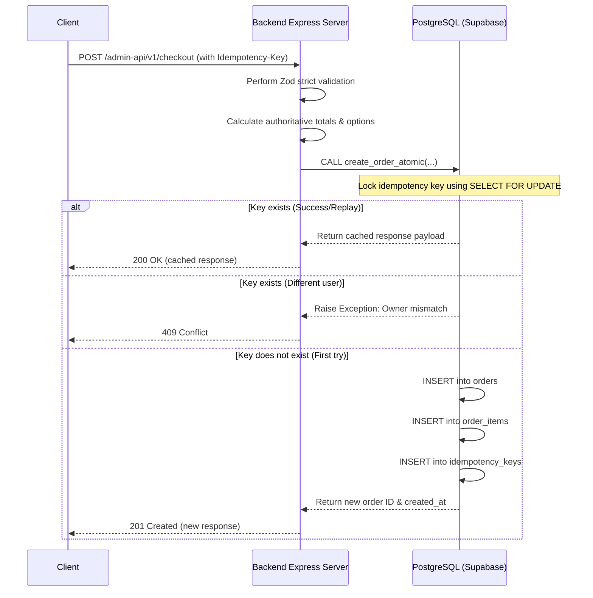

# Phase 2 Audit: Server-Authoritative Checkout and Payment Security

This report documents the security audit and transition of the JAHEEZ checkout and payment boundary to a secure, backend-decides architecture. The changes prevent client-side price tampering, block unauthorized wallet transactions, retire insecure legacy Stripe endpoints, and enforce atomic order creation.

---

## 1. Scope and Inventory

### Files Inspected
*   [checkout.routes.ts](file:///c:/Users/user/Desktop/jaheeez/Jaheez-v1/backend/src/routes/checkout.routes.ts) — Route declarations for orders, cancellations, and payments.
*   [checkout.controller.ts](file:///c:/Users/user/Desktop/jaheeez/Jaheez-v1/backend/src/controllers/checkout.controller.ts) — Handler functions extracting JWT context and headers.
*   [checkout.service.ts](file:///c:/Users/user/Desktop/jaheeez/Jaheez-v1/backend/src/services/checkout.service.ts) — Business logic calculating prices, checking promos, and validating options.
*   [checkout.repository.ts](file:///c:/Users/user/Desktop/jaheeez/Jaheez-v1/backend/src/repositories/checkout.repository.ts) — Postgres query selectors and atomic RPC calls.
*   [checkout.validators.ts](file:///c:/Users/user/Desktop/jaheeez/Jaheez-v1/backend/src/validators/checkout.validators.ts) — Strict Zod schema declarations.
*   [admin-api.js](file:///c:/Users/user/Desktop/jaheeez/Jaheez-v1/scripts/admin-api.js) — Monolith Stripe routes and flag checks.
*   [proxy.js](file:///c:/Users/user/Desktop/jaheeez/Jaheez-v1/scripts/proxy.js) — Path routing patterns.
*   [orderApi.ts](file:///c:/Users/user/Desktop/jaheeez/Jaheez-v1/user-app/lib/orderApi.ts) — Frontend client API methods.
*   [checkout.tsx](file:///c:/Users/user/Desktop/jaheeez/Jaheez-v1/user-app/app/(flows)/checkout.tsx) — User app order submission triggers.

### Files Modified & Created
1.  **[checkout.validators.ts](file:///c:/Users/user/Desktop/jaheeez/Jaheez-v1/backend/src/validators/checkout.validators.ts):** Added strict validations blocking client fields.
2.  **[checkout.repository.ts](file:///c:/Users/user/Desktop/jaheeez/Jaheez-v1/backend/src/repositories/checkout.repository.ts):** Retrieved JSONB `options` column and invoked atomic RPC.
3.  **[checkout.service.ts](file:///c:/Users/user/Desktop/jaheeez/Jaheez-v1/backend/src/services/checkout.service.ts):** Implemented DB-based pricing calculations and key checks.
4.  **[admin-api.js](file:///c:/Users/user/Desktop/jaheeez/Jaheez-v1/scripts/admin-api.js):** Set `LEGACY_STRIPE_ROUTES_ENABLED=false` and returned `410 Gone`.
5.  **[orderApi.ts](file:///c:/Users/user/Desktop/jaheeez/Jaheez-v1/user-app/lib/orderApi.ts):** Stripped client-supplied pricing fields from payloads.
6.  **[checkout.tsx](file:///c:/Users/user/Desktop/jaheeez/Jaheez-v1/user-app/app/(flows)/checkout.tsx):** Passed selected option IDs and stripped client totals.
7.  **[015_harden_wallets_rls.sql](file:///c:/Users/user/Desktop/jaheeez/Jaheez-v1/supabase_migrations/015_harden_wallets_rls.sql):** Hardened wallet tables to select-only policies.
8.  **[016_update_create_order_atomic.sql](file:///c:/Users/user/Desktop/jaheeez/Jaheez-v1/supabase_migrations/016_update_create_order_atomic.sql):** Created PG function to run transaction operations atomically.
9.  **[test-checkout-security.js](file:///c:/Users/user/Desktop/jaheeez/Jaheez-v1/scripts/test-checkout-security.js):** Automated diagnostic verification script.

---

## 2. Threat Model Analysis: Old vs. New

| Risk Vector | Legacy Monolith / Monolithic Route Behavior | Hardened MVC Architecture Behavior |
| :--- | :--- | :--- |
| **Pricing Tampering** | Client sent pre-calculated `unit_price`, `price_delta`, `total`, and `delivery_fee`. The server trusted and stored them directly. | Client fields are blocked via `zod.strict()`. Server queries store/item tables and option schemas to calculate totals. |
| **Wallet Manipulation** | Authenticated clients had write access to `wallets` and `wallet_transactions` tables. | RLS enables `SELECT` access only. Mutations are rejected on database Level. Backend service roles execute adjustments. |
| **Monolith Stripe Exploitation** | Monolith API accepted client-calculated amounts (`amount_centimes`) to generate sessions. | Enforced `LEGACY_STRIPE_ROUTES_ENABLED=false`. Monolith routes return `410 Gone`. MVC uses backend-calculated order totals. |
| **Order Replay / Double Tap** | Multiple taps on checkout button spawned duplicate orders since checking and writing were disconnected. | Idempotency keys are checked using PostgreSQL row-level locks and written atomically inside a single transaction. |

---

## 3. Checkout Contract and Validation Rules

The Zod validator [checkout.validators.ts](file:///c:/Users/user/Desktop/jaheeez/Jaheez-v1/backend/src/validators/checkout.validators.ts) enforces strict schemas using `.strict()`.

### Accepted Payload Schema
```typescript
{
  store_id: string;          // UUID format
  items: Array<{
    menu_item_id: string;    // UUID format
    quantity: number;        // integer, min 1, max 50
    options?: Array<{        // optional
      option_id: string;     // option group ID or label
      choice_id: string;     // selected choice ID
      choice_name?: string;  // optional, ignored server-side
    }>;
  }>;
  delivery_address: string;
  delivery_lat?: number;
  delivery_lng?: number;
  payment_method: 'cash' | 'card' | 'wallet';
  notes?: string;
  promo_code?: string;
  rider_tip?: number;
}
```

### Strictly Rejected Fields
If any of the following fields are sent in the checkout payload (root, items, or options objects), the request is rejected with `400 Bad Request`:
*   `price` / `unit_price` / `price_delta` / `subtotal` / `total` / `total_amount`
*   `delivery_fee` / `discount` / `payment_status` / `status` / `driver_id`

---

## 4. Official Server Pricing & Validation Logic

The [CheckoutService.processCheckout](file:///c:/Users/user/Desktop/jaheeez/Jaheez-v1/backend/src/services/checkout.service.ts) logic implements these steps:
1.  **Retrieve Database Records:** Fetch store details (checking `is_open` and fetching the official `delivery_fee`). Fetch menu items by IDs and store ID.
2.  **Verify Item Availability:** Reject if any menu item is missing from the store or has `is_available = false`.
3.  **Process Options & Extras:**
    *   Parse the item's official `options` JSONB column in the database.
    *   For each client selection, locate the matching option group and choice ID in the DB structure.
    *   Extract the official price delta `choice.extra` from the DB row and add it to the item's price.
    *   Verify that all required option groups (e.g. size, type) have a valid selection. Reject with `400 Bad Request` if omitted.
    *   Ignore any client-supplied `choice_name` or price fields during calculation.
4.  **Promotions Validation:** Validate the promo code against the `promotions` table, checking active range, minimum order requirements, and usage counts. Convert coupon values from database centimes to MAD.
5.  **Assemble Totals:**
    *   `Subtotal = Sum(Item Unit Price * Quantity)`
    *   `Total = Subtotal + Delivery Fee - Discount + Tip`

---

## 5. Database Transactions & Idempotency Rules

Idempotency and order creation are bound atomically via the PostgreSQL RPC function `create_order_atomic` in [016_update_create_order_atomic.sql](file:///c:/Users/user/Desktop/jaheeez/Jaheez-v1/supabase_migrations/016_update_create_order_atomic.sql).



*   **Header Enforced:** The `Idempotency-Key` header is required. Requests with a missing header return `400 Bad Request`.
*   **Atomic Rollback:** If any item creation fails, or the idempotency key insert violates constraints, Postgres rolls back the entire transaction. No partial orders are written.

---

## 6. Wallet Security (RLS Hardening)

To prevent direct frontend writes to wallet balances, we applied [015_harden_wallets_rls.sql](file:///c:/Users/user/Desktop/jaheeez/Jaheez-v1/supabase_migrations/015_harden_wallets_rls.sql).
*   **`SELECT` Rule:** Users can read only their own wallet balances and transactions.
    ```sql
    CREATE POLICY wallets_own_read ON public.wallets
    FOR SELECT USING (auth.uid() = user_id);
    ```
*   **No Mutations:** Client-side `INSERT`, `UPDATE`, or `DELETE` are disabled. All wallet modifications must originate from the backend using service-role credentials.

---

## 7. Legacy Stripe Monolith Disabling

*   Set `LEGACY_STRIPE_ROUTES_ENABLED=false` in [.env](file:///c:/Users/user/Desktop/jaheeez/Jaheez-v1/.env).
*   Updated [admin-api.js](file:///c:/Users/user/Desktop/jaheeez/Jaheez-v1/scripts/admin-api.js) to reject requests to legacy endpoints with a `410 Gone` response:
    ```javascript
    app.post('/admin-api/stripe/checkout-session', (req, res) => {
      return res.status(410).json({ error: "Legacy Stripe routes are disabled. Use the MVC checkout flow." });
    });
    ```

---

## 8. Frontend API Integration

*   **[orderApi.ts](file:///c:/Users/user/Desktop/jaheeez/Jaheez-v1/user-app/lib/orderApi.ts):** Updated `createOrder` to strip `unit_price`, totals, fees, and statuses. The function now maps options as IDs:
    ```typescript
    options: item.selected_options.map(o => ({
      option_id: o.option_id,
      choice_id: o.choice_id
    }))
    ```
*   **[stripeClient.ts](file:///c:/Users/user/Desktop/jaheeez/Jaheez-v1/user-app/lib/stripeClient.ts):** Calls `/admin-api/v1/payments/stripe/checkout-session` sending only the `order_id` and metadata. The Stripe payment amount is pulled directly from the backend-persisted database order total.

---

## 9. Security Test Results

Diagnostic tests were executed via [test-checkout-security.js](file:///c:/Users/user/Desktop/jaheeez/Jaheez-v1/scripts/test-checkout-security.js).

```bash
=== Starting JAHEEZ Phase 2 Security Tests ===

Found open store: Restaurant La Mer Bleue (88f48ee4-f9df-4550-bf94-6115a72072f0)
Item without options: Soupe de Poisson (03e8cb2d-0d1f-437a-929d-3ef6e9e10fae)
Item with options: Sardines Grillées (283bfce6-7e8e-48e3-a26e-5321552c2ac8)

Creating temporary test users...
Test users created and logged in successfully.

[PASS] 1. Missing JWT returns 401: Status: 401, Error: Token manquant
[PASS] 2. Malformed payload returns 400: Status: 400 (Rejected successfully)
[PASS] 3. Payload containing price_delta returns 400: Status: 400, Message: undefined
[PASS] 4. Required option omitted returns 400: Status: 400, Error: الخيار 'الحجم' مطلوب
[PASS] 5. Invalid option choice returns 400: Status: 400, Error: الاختيار 'non-existent-choice-id' غير صالح لمجموعة الخيارات 'الحجم'
[PASS] 6. Duplicate idempotency key returns same cached response: First status: 201, Second status: 200, OrderId: fb953b0d-f2a7-4f7a-b79b-6adfc4452c2a, IsReplay: true
[PASS] 7. Same idempotency key with different user rejected: Status: 409, Error: Idempotency key belongs to another user
[PASS] 8. Direct wallet write/insert blocked by RLS: Update Err: none (no row matched/blocked), Insert Err: new row violates row-level security policy for table "wallet_transactions"
[PASS] 9. Legacy Stripe checkout endpoint returns 410: Status: 410, Error: Legacy Stripe routes are disabled. Use the MVC checkout flow.
[PASS] 10. Legacy Stripe session endpoint returns 410: Status: 410, Error: Legacy Stripe routes are disabled. Use the MVC checkout flow.
[PASS] 11. Backend checkout route through proxy returns 401 without token: Status: 401, Error: Token manquant

Cleaning up test users...
Cleanup complete.

=== Test Summary: 11/11 passed ===
ALL TESTS PASSED SUCCESSFULLY! Security boundary verified.
```

---

## 10. Verification Commands Executed
```powershell
# 1. Compile backend code
cd backend
npm run build

# 2. Start servers & proxy
node scripts/proxy.js
node scripts/admin-api.js
npm run dev

# 3. Verify proxied and legacy routing via curl
curl.exe -i http://localhost:3002/health
curl.exe -X POST -i http://localhost:5000/admin-api/v1/checkout
curl.exe -X POST -i http://localhost:5000/admin-api/stripe/checkout-session
curl.exe -i http://localhost:5000/admin-api/stripe/session/test

# 4. Run automated test suite
node scripts/test-checkout-security.js
```

---

## 11. Remaining Risks & Next Steps
*   **Remaining Risks:**
    *   Stripe webhook security: Ensure Stripe webhooks verify signatures correctly to prevent fake payment completion events.
    *   Rate limiting: While there is basic Express rate limiting, checkout endpoints should have stricter, key-specific limits (e.g. rate-limit by user ID or IP).
*   **Next Phase:** Phase 3 — Migrate remaining legacy admin/operations endpoints from monolith on port 3001 to new MVC backend on port 3002.
