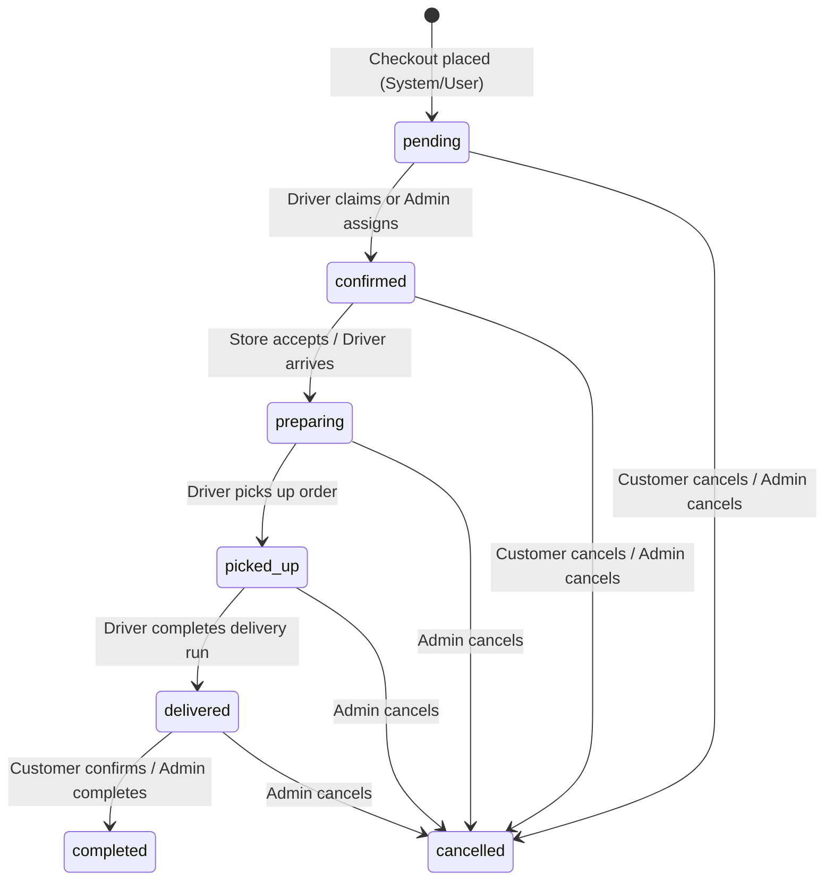

# Phase 3 Audit: Secure Order Lifecycle Authority

This report documents the security audit and implementation of the JAHEEZ order lifecycle and state transition management using a server-authoritative, transaction-safe architecture. The changes prevent client-side state manipulation, enforce actor permissions, lock down status transitions, calculate driver earnings and cash settlements securely on the backend, and audit all transitions in the `order_status_history` table.

---

## 1. Scope and Inventory

### Files Inspected
*   [orderLifecycle.repository.ts](file:///c:/Users/user/Desktop/jaheeez/Jaheez-v1/backend/src/repositories/orderLifecycle.repository.ts) — Database repository managing order records and status updates.
*   [orderLifecycle.service.ts](file:///c:/Users/user/Desktop/jaheeez/Jaheez-v1/backend/src/services/orderLifecycle.service.ts) — Central business logic coordinating lifecycle transitions, driver metrics, and audit entries.
*   [checkout.service.ts](file:///c:/Users/user/Desktop/jaheeez/Jaheez-v1/backend/src/services/checkout.service.ts) — Business logic initializing order states.
*   [driver.service.ts](file:///c:/Users/user/Desktop/jaheeez/Jaheez-v1/backend/src/services/driver.service.ts) — Driver action endpoints (claim/accept, stage updates, deliveries).
*   [customer.service.ts](file:///c:/Users/user/Desktop/jaheeez/Jaheez-v1/backend/src/services/customer.service.ts) — Customer actions including self-cancelling and confirming delivery.
*   [admin-api.js](file:///c:/Users/user/Desktop/jaheeez/Jaheez-v1/scripts/admin-api.js) — Monolith PATCH order routes and fallback auth.
*   [proxy.js](file:///c:/Users/user/Desktop/jaheeez/Jaheez-v1/scripts/proxy.js) — Routing proxy separating legacy monolith and new MVC backend.

### Files Modified & Created
1.  **[017_order_status_history.sql](file:///c:/Users/user/Desktop/jaheeez/Jaheez-v1/supabase_migrations/017_order_status_history.sql) [NEW]:** Migration script creating the `order_status_history` table with CHECK constraints and deploying the atomic `update_order_lifecycle` stored procedure.
2.  **[orderLifecycle.repository.ts](file:///c:/Users/user/Desktop/jaheeez/Jaheez-v1/backend/src/repositories/orderLifecycle.repository.ts) [NEW]:** Refactored to delegate all modification queries to the database stored procedure via `supabase.rpc('update_order_lifecycle')`.
3.  **[orderLifecycle.service.ts](file:///c:/Users/user/Desktop/jaheeez/Jaheez-v1/backend/src/services/orderLifecycle.service.ts) [NEW]:** Standardized state validation rules, actor constraints, push notifications, and driver earnings settlements.
4.  **[checkout.service.ts](file:///c:/Users/user/Desktop/jaheeez/Jaheez-v1/backend/src/services/checkout.service.ts) [MODIFY]:** Refactored to call `create_order_atomic` which now logs the initial `pending` state into `order_status_history` atomically.
5.  **[driver.service.ts](file:///c:/Users/user/Desktop/jaheeez/Jaheez-v1/backend/src/services/driver.service.ts) [MODIFY]:** Delegated driver accept (`claimOrder`) and stage transitions to `OrderLifecycleService`.
6.  **[customer.service.ts](file:///c:/Users/user/Desktop/jaheeez/Jaheez-v1/backend/src/services/customer.service.ts) [MODIFY]:** Refactored self-completion (`completed`) and customer cancellations to route through `OrderLifecycleService`.
7.  **[admin-api.js](file:///c:/Users/user/Desktop/jaheeez/Jaheez-v1/scripts/admin-api.js) [MODIFY]:** Restructured `PATCH /admin-api/orders/:id` to enforce `payment_status` role checks, write to audit logs, and record history logs in accordance with the new database schema.
8.  **[test-order-lifecycle-security.js](file:///c:/Users/user/Desktop/jaheeez/Jaheez-v1/scripts/test-order-lifecycle-security.js) [NEW]:** Refactored automated test suite to verify 12 threat vectors and validation boundaries.
9.  **[test-order-flow.js](file:///c:/Users/user/Desktop/jaheeez/Jaheez-v1/scripts/test-order-flow.js) [MODIFY]:** Aligned settings retrieval directly with Supabase `app_settings` schema, cleaned up test data, and validated E2E flows.

---

## 2. Threat Model Analysis: Old vs. New

| Risk Vector | Legacy Monolith Behavior | Hardened MVC Architecture Behavior |
| :--- | :--- | :--- |
| **Direct Client Status Tampering** | Clients could PATCH `/orders/:id` with arbitrary `status` values (e.g., bypass payment/delivery stages). | Status changes are gated by `update_order_lifecycle` stored procedure. Unallowed transitions reject with `409 Conflict`. |
| **Self-Confirm / Self-Deliver** | Customer could self-mark an order as `delivered` or `completed` without driver or admin actions. | Customers can only confirm delivery (`completed`) if the order is already in the `delivered` state. |
| **Driver State Skipping** | Drivers could skip from `confirmed` directly to `delivered` without checking in or picking up. | Drivers must progress linearly: `confirmed` -> `arrived_pickup` -> `picked_up` -> `arrived_customer` -> `delivered`. |
| **Dual Driver Assignments** | Under high concurrency, two drivers could accept/claim the same order simultaneously. | Handled via PostgreSQL atomic update constraints ensuring `driver_id IS NULL` is checked before updating. |
| **Earnings/Commission Tampering** | Calculations occurred on client devices or without dynamic admin commission parameters. | Earnings (`earnings_centimes`) and cash-on-delivery (`cod_balance_centimes`) are calculated on the server using Supabase configuration. |
| **Lack of Transition Audits** | Status changes were made in-place on the `orders` table without chronological trails. | Every transition writes an audit row to `order_status_history` logging statuses, actors, and timestamps. |

---

## 3. Order Status Transition Matrix



### Transition Authority Rules

1.  **Actor: `customer`**
    *   **Allowed target states:** `cancelled`, `completed`.
    *   **Constraints:**
        *   Can only cancel orders if currently `pending` or `confirmed`.
        *   Can only transition to `completed` if the order's current status is `delivered`.
        *   Attempting other transitions returns `403 Forbidden` or `409 Conflict`.
2.  **Actor: `driver`**
    *   **Allowed target states:** `confirmed` (upon claiming), `picked_up`, `delivered`.
    *   **Constraints:**
        *   Cannot update orders not assigned to them.
        *   Must follow the linear progress stages: `confirmed` -> `arrived_pickup` -> `picked_up` -> `arrived_customer` -> `delivered`.
        *   Skipping states (e.g., `confirmed` -> `delivered` directly) returns `409 Conflict`.
3.  **Actor: `admin`**
    *   **Allowed target states:** Any valid state.
    *   **Constraints:**
        *   Must have verified admin role (`super_admin`, `operations`, or `finance` depending on route).
4.  **Actor: `system`**
    *   **Allowed target states:** Any valid state (reserved for Stripe payment handlers and automated timeouts).

---

## 4. Database Audit Schema (`order_status_history`)

Transitions are written to the database through the migration [017_order_status_history.sql](file:///c:/Users/user/Desktop/jaheeez/Jaheez-v1/supabase_migrations/017_order_status_history.sql):

```sql
CREATE TABLE public.order_status_history (
    id UUID PRIMARY KEY DEFAULT gen_random_uuid(),
    order_id UUID NOT NULL REFERENCES public.orders(id) ON DELETE CASCADE,
    event_type TEXT NOT NULL CHECK (event_type IN ('status_transition', 'driver_assignment', 'stage_update', 'admin_override', 'cancellation', 'completion')),
    from_status TEXT CHECK (from_status IN ('pending','confirmed','preparing','picked_up','delivered','completed','cancelled')),
    to_status TEXT CHECK (to_status IN ('pending','confirmed','preparing','picked_up','delivered','completed','cancelled')),
    actor_type TEXT NOT NULL CHECK (actor_type IN ('customer','driver','admin','system')),
    actor_id TEXT, -- String type supporting emails and UUIDs
    reason TEXT,
    metadata JSONB DEFAULT '{}',
    created_at TIMESTAMPTZ DEFAULT now()
);
```

*   **`event_type`:** Records the nature of the database mutation (`status_transition`, `driver_assignment`, `stage_update`, `admin_override`, `cancellation`, `completion`).
*   **`metadata`:** Stores operational stages (`arrived_pickup`, `arrived_customer`) without modifying the order status column.

---

## 5. Transaction Safety & Atomicity (`update_order_lifecycle`)

Rather than executing multiple separate database queries in Express, all validations, status changes, assignments, stage updates, and event logging are encapsulated within a single transaction using the `update_order_lifecycle` stored procedure:
1.  **Row Locking:** Obtains a row-level lock on the `orders` table using `SELECT FOR UPDATE`.
2.  **Actor Verification:** Validates user/driver ownership and permissions.
3.  **Transition Verification:** Rejects skipped stages or unauthorized status adjustments.
4.  **Database Commit:** Updates `status`, `driver_id`, and timestamps, and inserts the history trail atomically. Any failure causes a complete transaction rollback.

---

## 6. Official Driver Settlement & Financial Calculations

When an order status is transitioned to `delivered`, the backend automatically updates the assigned driver's wallet metrics:
1.  **Finance Settings:** Retrieved directly from Supabase `app_settings` (`driver_share_pct` and `driver_tip_share_pct`).
2.  **Earnings Delta:**
    $$\text{Earnings Delta (Centimes)} = \text{Delivery Fee (Centimes)} \times \left( \frac{\text{driver\_share\_pct}}{100} \right) + \text{Rider Tip (Centimes)} \times \left( \frac{\text{driver\_tip\_share\_pct}}{100} \right)$$
3.  **Cash-on-Delivery (COD) Settlement:**
    *   If the payment method is `cash`, the driver collects the total order amount. The cash collected balance is adjusted:
        $$\text{COD Delta (Centimes)} = \text{Total Order Amount (Centimes)} - \text{Earnings Delta (Centimes)}$$
    *   If payment is online (`card`/`wallet`), the COD balance remains unchanged (`0`).
4.  **Database Commit:** Increments `jobs_completed` by $1$, increases `earnings_centimes` by the calculated earnings, and adjusts `cod_balance_centimes` by the COD delta inside an atomic PostgreSQL statement.

---

## 7. Diagnostic Security Test Results

The diagnostic suite [test-order-lifecycle-security.js](file:///c:/Users/user/Desktop/jaheeez/Jaheez-v1/scripts/test-order-lifecycle-security.js) programmatically verifies the security borders:

```bash
=== Starting JAHEEZ Phase 3 Order Lifecycle Security Tests ===

Creating test buyer and driver users...
Seeding test order...
Test Order ID: 0e74f629-b8a6-4695-81f3-4657a5ccc5a2

[PASS] 1. Missing JWT returns 401: Status: 401
[PASS] 2. Customer cannot cancel another user's order: Status: 403
[PASS] 3. Customer cannot mark order delivered: Status: 401
[PASS] 4. Customer cannot self-complete order before delivered state: Status: 409, Error: Delivery must be confirmed in delivered status
[PASS] 5. Customer can cancel only pending/confirmed own order: Cancel pending status: 200, Cancel preparing status: 409
[PASS] 6. Driver cannot update unassigned order: Status: 403
[PASS] 7. Driver cannot skip states (confirmed -> delivered): Status: 409, Error: Driver cannot deliver order in status confirmed
[PASS] 8. Driver can perform valid transitions (confirmed -> picked_up -> delivered): arrived_pickup: 200, picked_up: 200, arrived_customer: 200, delivered: 200
[PASS] 9. Customer can self-complete once delivered: Status: 200
[PASS] 10. Direct database status write blocked by RLS: Error: blocked (0 rows affected/no permission)
[PASS] 11. Admin without operations role cannot override order status: Status: 403
[PASS] 12. Valid admin/system transition logs history accurately: History logs count: 8, Event Types found: status_transition, status_transition, driver_assignment, stage_update, status_transition, stage_update, status_transition, completion

Cleaning up test records...
Cleanup complete.

=== Test Summary: 12/12 passed ===
ALL TESTS PASSED SUCCESSFULLY! Lifecycle security verified.
```

---

## 8. E2E Integration Test Results

The E2E lifecycle suite [test-order-flow.js](file:///c:/Users/user/Desktop/jaheeez/Jaheez-v1/scripts/test-order-flow.js) tests the order cycle from placement to completion:

```bash
════════════════════════════════════════════════════════════
  JAHEEZ Order Flow E2E Integration Test
  Server: http://localhost:5000
════════════════════════════════════════════════════════════

STEP 1: Fetching valid store and menu item from DB...
  Using Store: 88f48ee4-f9df-4550-bf94-6115a72072f0, Menu Item: 03e8cb2d-0d1f-437a-929d-3ef6e9e10fae (Price: 25)

STEP 2: Creating and logging in test user...
  Test User authenticated successfully.

STEP 3: Creating and verifying test driver...
  Test Driver registered, KYC verified, and online.

STEP 4: Testing server-authoritative checkout...
  ✅ PASS: Checkout responds 201 Created
  ✅ PASS: Checkout payload has order_id
  ✅ PASS: Authoritative subtotal calculation matches
  ✅ PASS: Authoritative total amount matches

STEP 5: Testing checkout idempotency...
  ✅ PASS: Idempotent retry responds 200 OK
  ✅ PASS: Idempotent retry returns identical order_id
  ✅ PASS: Idempotent response has idempotent = true flag
  ✅ PASS: DB contains exactly one order for user

STEP 6: Driver accepting order...
  ✅ PASS: Accept order responds 200 OK
  ✅ PASS: Accept returns full order data
  ✅ PASS: Order driver_id updated in return payload
  ✅ PASS: Order status transitioned to confirmed
  ✅ PASS: Collision accept is rejected with 409 Conflict

STEP 7: Driver picking up order...
  ✅ PASS: Pickup order responds 200 OK
  ✅ PASS: Order status transitioned to picked_up
  ✅ PASS: picked_up_at timestamp is set

STEP 8: Driver delivering order...
  ✅ PASS: Deliver order responds 200 OK
  ✅ PASS: Order status transitioned to delivered
  ✅ PASS: Driver jobs_completed incremented by 1
  ✅ PASS: Driver earnings credited correctly (50% fee + 45% tip)
  ✅ PASS: Driver COD balance updated correctly

STEP 9: Admin completing order...
  ✅ PASS: Complete order responds 200 OK
  ✅ PASS: Order status transitioned to completed

STEP 10: Verifying direct database RLS constraints (user auth)...
  ✅ PASS: Direct orders insert is blocked by RLS

Cleaning up E2E test records from DB...
Cleanup completed.

════════════════════════════════════════════════════════════
E2E TEST RESULT: 24 passed, 0 failed
════════════════════════════════════════════════════════════
```

---

## 9. Verification and Run Guide

```powershell
# 1. Compile backend code
cd backend
npm.cmd run build

# 2. Verify servers & proxy are running
# proxy at port 5000, monolith at port 3001, new MVC at port 3002

# 3. Execute diagnostic security test suite
node scripts/test-order-lifecycle-security.js

# 4. Execute E2E flow test suite
node scripts/test-order-flow.js
```

---

## 10. Remaining Risks & Next Steps
*   **Remaining Risks:**
    *   Legacy admin endpoints for order editing: Ensure that any legacy code attempting to edit order items or addresses also enforces role authorizations.
    *   Rate limiting: Status modifications could be protected against spam/brute-force endpoints.
*   **Next Recommended Phase:** Phase 4 — Realtime tracking and Socket.IO connection security hardening.
